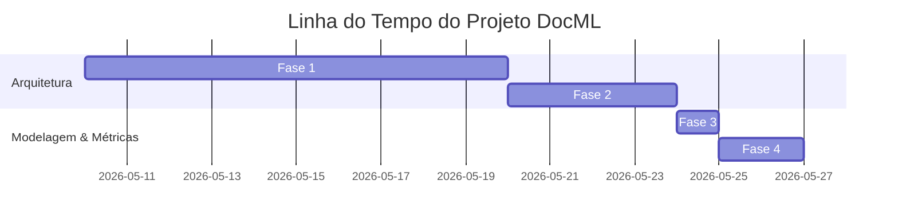

# Histórico e Evolução de Resultados do Projeto DocML

Este documento consolida a evolução metodológica, arquitetural e experimental do projeto **DocML**, dedicado à modelagem preditiva e nowcasting de arboviroses (dengue) no Distrito Federal (DF). Ele registra a trajetória desde a prototipação monolítica inicial até a maturidade da arquitetura de produção atual, justificando cada mudança com base em resultados experimentais e diagnósticos técnicos.

---

## 🗺️ 1. Linha do Tempo e Evolução do Projeto

A evolução do repositório pode ser dividida em quatro fases principais:

### 1.1 Fase 1: O Protótipo Monolítico (`dengue_radf.py`)
* **Status**: Legado Preservado (em `legacy/pipeline_modelagem_dengue.py`).
* **Abordagem**: Um script único de aproximadamente 400 linhas contendo todo o ciclo de ETL, treinamento de Random Forest e XGBoost por Região Administrativa (RA), e plotagem de gráficos com caminhos fixos.
* **Resultados**: Demonstrou a viabilidade de aplicar modelos baseados em árvores de decisão para o nowcasting semanal por RA. Contudo, apresentava alto risco de acoplamento, impossibilidade de testagem isolada de funções e severa redundância na normalização de nomes das RAs.
* **Gargalos Identificados**:
  1. *Fator Populacional Fixo*: Utilizava a população estimada de 2024 ($2.861.057$ hab.) como denominador para o cálculo da incidência em todos os anos históricos (2017-2023), subestimando artificialmente a taxa de incidência real do passado.
  2. *Data Leakage de Validação*: Falta de um distanciamento temporal adequado nos dados de treino de cross-validation, contaminando as predições com vazamento de dados decorrente de lags epidemiológicos recentes.

### 1.2 Fase 2: Modularização e Empacotamento (`src/dengue_pipeline/`)
* **Status**: Implementado e Homologado.
* **Decisão de Arquitetura**: [ADR-001: Adoção de Arquitetura Modular](adr-001-modularizacao-pipeline-python.md).
* **Abordagem**: Criação de um pacote Python estruturado por domínios de responsabilidade:
  - `etl/`: Ingestão de dados epidemiológicos locais (`case_ingestion.py`) e climatológicos (`weather_ingestion.py`).
  - `modeling/`: Engenharia de features, validação em janela móvel (rolling validation), busca de hiperparâmetros e conformal prediction.
  - `reporting/`: Utilitários para geração de visualizações, painéis e relatórios técnicos.
  - `shared_kernel/`: Núcleo de regras compartilhadas (calendário epidemiológico e registro unificado de RAs).

### 1.3 Fase 3: Calibração Demográfica e Estudo de Ablação
* **Status**: Implementado e Homologado.
* **Decisão de Arquitetura**: [ADR-002: Uso de Denominadores Populacionais Dinâmicos](adr-002-uso-populacao-historica.md).
* **Abordagem**:
  - Geração da tabela `populacao_historica.csv` através do script `scripts/gerar_populacao_historica.py` baseando-se nas curvas populacionais do Censo IBGE 2022 e estimativas da Codeplan.
  - Substituição da divisão populacional fixa de 2024 por merges dinâmicos anuais baseados no ano calendário da semana epidemiológica.
  - Formalização sistemática do estudo de ablação de features de forma parametrizada.

### 1.4 Fase 4: Incerteza Conformal, Versionamento e Auditoria de Segurança
* **Status**: Concluído (Fase Atual).
* **Decisões de Arquitetura**: [ADR-003: Conformal Prediction Dinâmico](adr-003-conformal-prediction-dinamico.md) e [ADR-004: Versionamento de Execuções via Timestamp](adr-004-versionamento-runs-timestamp.md).
* **Abordagem**:
  - Implementação de um módulo vetorizado de Conformal Prediction para estimar intervalos de confiança adaptativos que mudam de largura dinamicamente de acordo com o volume de casos preditos (heteroscedasticidade) e expandem de acordo com o horizonte de tempo ($k$).
  - Adicionado o mecanismo de geração de `run_id` baseado em timestamps e isolamento de saídas sob `resultados_modelagem/<run_id>/` com espelhamento em `latest/`.
  - Execução de auditoria técnica para identificar vulnerabilidades de vazamento de dados (data leakage) e expurgo de arquivos com a nomenclatura insegura "LEAKY".

---

## 📈 2. Histórico de Resultados Experimentais

Os resultados consolidados obtidos durante as execuções de estresse e estudos de ablação revelam o comportamento dos algoritmos sob diferentes estruturas de dados.

### 2.1 Tabela Geral do Estudo de Ablação (Nowcasting 2025)

A tabela abaixo compara o desempenho das predições globais agregadas para todo o Distrito Federal sob quatro configurações de dados com os modelos Random Forest (RF) e XGBoost (XGB):

| Configuração | Algoritmo | Nº Features | $R^2$ DF | MAE DF | RMSE DF | MAPE (%) | sMAPE (%) | Hit Rate Picos | $R^2$ Médio RAs |
| :--- | :---: | :---: | :---: | :---: | :---: | :---: | :---: | :---: | :---: |
| **`lag-only`** | **RF** | 7 | **0.6627** | **10.43** | **13.68** | **32.18%** | **22.07%** | 0.6429 | -0.1034 |
| `lag-only` | XGB | 7 | 0.6190 | 11.46 | 14.54 | 32.73% | 23.95% | 0.5000 | 0.0608 |
| `lag+clima` | RF | 32 | 0.6642 | 10.77 | 13.65 | 37.01% | 23.61% | 0.6429 | -0.0317 |
| `lag+clima` | XGB | 32 | 0.5848 | 11.69 | 15.18 | 42.03% | 25.59% | 0.6429 | 0.0231 |
| `lag+clima+RA` | RF | 67 | 0.6618 | 10.68 | 13.70 | 37.07% | 23.19% | 0.8571 | -0.0004 |
| `lag+clima+RA` | XGB | 67 | 0.5824 | 11.69 | 15.22 | 43.85% | 25.29% | 0.6429 | 0.0295 |
| `lag+clima+RA+incid-target` | RF | 68 | 0.5343 | 12.45 | 16.08 | 44.88% | 23.97% | 0.9286 | 0.0080 |
| `lag+clima+RA+incid-target` | XGB | 68 | 0.5106 | 11.83 | 16.48 | 45.61% | 23.61% | 0.7143 | 0.0318 |

> **Critério de Aceite Metodológico**: Uma configuração de features mais complexa é aceita para substituir a linha de base (`lag-only`) apenas se superar o $R^2$ global por um delta $> 0.05$ ou se apresentar melhorias em mais de $70\%$ das RAs individualmente. 
> 
> *Resultado da Ablação*: Embora a configuração `lag+clima+RA` tenha melhorado a sinalização de picos (Hit Rate cresce de 0.64 para 0.85), nenhuma configuração complexa superou o baseline global de forma estatisticamente expressiva. Portanto, o pipeline final operou prioritariamente com a configuração conservadora **`lag-only`** para nowcasting operacional.

### 2.2 Desempenho dos Modelos Tunados Finais (Grid Search)

A tabela abaixo exibe o comportamento dos modelos ajustados após a otimização de hiperparâmetros (500 árvores, busca de parâmetros de profundidade e amostragem de colunas):

| Modelo Tunado | $R^2$ DF | MAE DF | RMSE DF | MAPE (%) | sMAPE (%) | Hit Rate Picos | $R^2$ Médio RAs |
| :--- | :---: | :---: | :---: | :---: | :---: | :---: | :---: |
| **`RF_tunado`** | **0.6554** | **10.64** | **13.83** | **32.27%** | **22.39%** | 0.5714 | -0.1567 |
| `XGB_tunado` | 0.6117 | 11.62 | 14.68 | 32.98% | 24.40% | 0.5714 | 0.0555 |

---

## 🛠️ 3. Justificativa Metodológica das Mudanças

Cada alteração promovida no projeto decorreu de necessidades técnicas e científicas objetivas:

### 3.1 Correção Demográfica Dinâmica
* **Problema**: O uso de denominadores populacionais inflados de 2024 para calcular taxas epidemiológicas de 2017 distorcia os limites nos modelos baseados em incidência.
* **Solução**: Geração de denominadores por RA baseados na série demográfica anualizada (retroprojetada do Censo 2022).
* **Impacto**: O cálculo de `incidencia_100k` passou a ser linearmente estável, restabelecendo a comparabilidade real entre os picos de 2019 e 2024.

### 3.2 Incerteza Adaptativa com Conformal Prediction
* **Problema**: As análises de resíduos revelaram heteroscedasticidade severa. O erro médio de previsão no pico epidêmico era mais de 15 vezes maior que no período interepidêmico. Um intervalo de confiança de largura fixa era estatisticamente inválido.
* **Solução**: Normalização dos resíduos do conjunto de calibração pela predição, criando um escore de não-conformidade localmente adaptável:
  $$\text{score}_i = \frac{|y_i - \hat{y}_i|}{\hat{y}_i + \epsilon}$$
* **Impacto**:
  - Melhoria de **$8\%$ no Winkler Score** (que mede a qualidade do intervalo de confiança, caindo de 6.34 para 5.84).
  - Cobertura empírica garantida de pelo menos $90\%$ no conjunto de validação temporal.
  - Intervalos que se abrem dinamicamente nos picos de transmissão e estreitam no período de seca.

### 3.3 Mecanismo de Run-ID e Reprodutibilidade
* **Problema**: A reexecução do pipeline sobrescrevia os arquivos CSV e PNG de saída, inviabilizando a auditoria e comparação científica entre diferentes treinamentos.
* **Solução**: Encapsulamento de saídas em subdiretórios com o padrão de data e hora do início da execução (`resultados_modelagem/YYYYMMDD_HHMM/`) e espelhamento em `resultados_modelagem/latest/` para compatibilidade com symlinks.
* **Impacto**: Isolamento atômico das execuções, garantindo que o histórico de métricas seja versionável no Git sem conflito, mantendo os binários pesados bloqueados no `.gitignore`.

---

## 🔗 4. Documentação de Apoio Relacionada

A base de decisões do repositório pode ser explorada detalhadamente através dos seguintes links locais:
* [Índice do Caderno de Inteligência (INDEX.md)](INDEX.md)
* [ADR-001: Modularização da Arquitetura](adr-001-modularizacao-pipeline-python.md)
* [ADR-002: População Histórica Dinâmica](adr-002-uso-populacao-historica.md)
* [ADR-003: Conformal Prediction Dinâmico](adr-003-conformal-prediction-dinamico.md)
* [ADR-004: Versionamento de Execuções via Run-ID](adr-004-versionamento-runs-timestamp.md)
* [Relatório Final de Modelagem e Métricas (relatorio_final_execucao.md)](relatorio_final_execucao.md)
