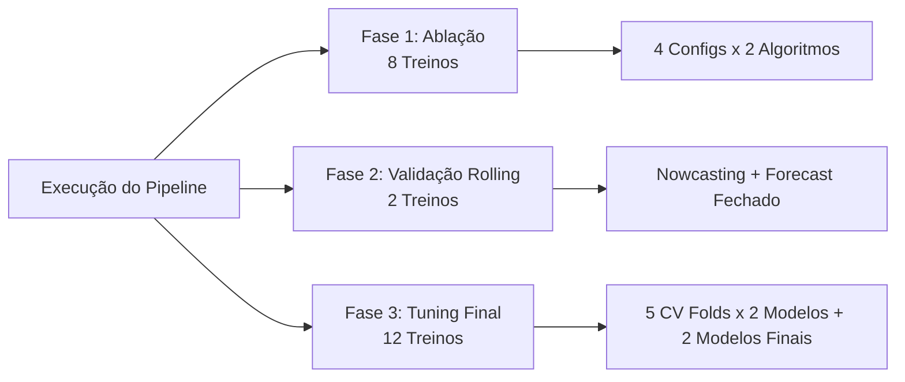

# Especificação de Parâmetros e Combinações de Treinamento — DocML

Este documento detalha todos os hiperparâmetros, conjuntos de features, divisões de validação e o número exato de combinações e ajustes de modelos (`.fit()`) realizados a cada execução completa do pipeline **DocML** no Distrito Federal.

---

## 1. Mapeamento de Hiperparâmetros por Algoritmo

O DocML treina dois algoritmos preditores baseados em árvores de decisão: **Random Forest (RF)** e **XGBoost (XGB)**. Os parâmetros são estruturados em duas fases: inicialização base (usada em ablações e validações preliminares) e busca em grade (Grid Search) final.

### 1.1 Random Forest Regressor (RF)
*   **Fase Base/Default**:
    *   `n_estimators = 150` (Número de árvores na floresta).
    *   `max_depth = 15` (Profundidade máxima de cada árvore para evitar consumo excessivo de memória).
    *   `random_state = 42` (Garante reprodutibilidade científica).
    *   `n_jobs = -1` (Paralelização máxima utilizando todos os núcleos do processador).
*   **Fase de Otimização (Grid Search Finais)**:
    *   `n_estimators = 500` (Expandido para maior convergência e redução de variância).
    *   `max_depth = None` (Crescimento ilimitado de nós até que folhas fiquem puras ou tenham menos de 2 amostras).
    *   `min_samples_leaf = 1` (Número mínimo de amostras em folha).
    *   `max_features = 'sqrt'` (Considera apenas $\sqrt{M}$ features a cada divisão de nó. Melhora drasticamente a robustez contra multicolinearidade e overfitting).

### 1.2 XGBoost Regressor (XGB)
*   **Fase Base/Default**:
    *   `n_estimators = 200` (Número de rodadas de boosting).
    *   `learning_rate = 0.05` (Taxa de aprendizado/encolhimento).
    *   `max_depth = 4` (Profundidade rasa para mitigar overfitting de boosting).
    *   `random_state = 42` (Reprodutibilidade).
    *   `objective = 'reg:squarederror'` (Minimização de erro quadrático médio).
    *   `tree_method = 'hist'` (Algoritmo de discretização por histograma rápido em CPU).
*   **Fase de Otimização (Grid Search Finais)**:
    *   `n_estimators = 500` (Maior número de iterações de correção residual).
    *   `max_depth = 3` (Máxima regularização controlando a interação de variáveis).
    *   `learning_rate = 0.1` (Taxa de correção acelerada).
    *   `subsample = 1.0` (Sem amostragem de linhas).
    *   `colsample_bytree = 0.8` (Subamostragem de $80\%$ das features por árvore para induzir diversidade no ensemble).

---

## 2. Quantificação Exata de Combinações e Treinamentos

A cada execução completa do comando `python -m dengue_pipeline`, o orquestrador coordena **três fases distintas** de treinamento de Machine Learning. 

Abaixo está o detalhamento matemático do número exato de treinos (`.fit()`) disparados no sistema:

```
Total de Model Fits = (Fase 1: Ablação) + (Fase 2: Validação Temporal) + (Fase 3: Tuning Final)
```



### 2.1 Fase 1: Estudo de Ablação de Features
Nesta fase, avaliamos sistematicamente a contribuição incremental de grupos de features sobre o nowcasting (ano de validação 2025). 
*   **Estratégias de Features ($4\text{ configurações}$)**:
    1.  `lag-only`: 7 features autoregressivas básicas de casos.
    2.  `lag+clima`: 32 features (lags climáticos de temperatura, chuva e umidade).
    3.  `lag+clima+RA`: 67 features (inclusão de dummies espaciais binárias por RA).
    4.  `lag+clima+RA+incid-target`: 68 features (predição de taxa por 100k hab. com merge populacional).
*   **Algoritmos ($2\text{ modelos}$)**: `Random Forest` e `XGBoost`.
*   **Cálculo**: 
$$\text{Treinos}_{\text{Ablação}} = 4 \text{ Configs} \times 2 \text{ Modelos} = \mathbf{8\text{ treinos}}$$

### 2.2 Fase 2: Validação Temporal em Janela Móvel (Rolling Validation)
Nesta fase, realizamos a simulação do nowcasting semanal e a projeção fechada recursiva para 2025 usando o Random Forest na configuração padrão de produção (`lag+clima+RA`).
*   **Ajustes**:
    1.  Treinamento do Random Forest para nowcasting em janela rolante = $1$ treino.
    2.  Treinamento do Random Forest limpo para o forecast recursivo fechado (onde as predições se retroalimentam para lags futuros) = $1$ treino.
*   **Cálculo**:
$$\text{Treinos}_{\text{Validação}} = \mathbf{2\text{ treinos}}$$

### 2.3 Fase 3: Otimização de Hiperparâmetros (Grid Search)
Nesta fase, o modelo que venceu a ablação (baseline robusta `lag-only`) é submetido à busca fina em grade usando validação cruzada temporal de $5$ folds e gap de 4 semanas.
*   **Validação Cruzada (Grid Search)**:
    - Random Forest ($1$ combinação de parâmetros $\times 5$ folds de séries temporais) = $5$ treinos.
    - XGBoost ($1$ combinação de parâmetros $\times 5$ folds de séries temporais) = $5$ treinos.
*   **Ajuste Final de Produção**:
    - Treinamento do Random Forest com os melhores parâmetros na base completa pré-2025 = $1$ treino.
    - Treinamento do XGBoost com os melhores parâmetros na base completa pré-2025 = $1$ treino.
*   **Cálculo**:
$$\text{Treinos}_{\text{Tuning}} = \left(2 \text{ Modelos} \times 1 \text{ Combinação} \times 5 \text{ Folds}\right) + 2 \text{ Ajustes Finais} = \mathbf{12\text{ treinos}}$$

---

## 3. Resumo Consolidado de Carga Computacional

| Fase do Pipeline | Função Código | Algoritmos | Tipo de Treino | Treinos (`.fit()`) |
|---|---|---|---|---|
| **1. Estudo de Ablação** | `executar_estudo_ablacao()` | RF, XGB | Train-Test Fixo (Treino < 2025, Valida 2025) | 8 |
| **2. Validação Temporal** | `executar_validacao_temporal()` | RF | Simulação de Forecast Fechado e Nowcasting | 2 |
| **3. Tuning & Produção** | `otimizar_hiperparametros()` | RF, XGB | TimeSeriesSplit (5 Splits) + Ajuste Final | 12 |
| **Total Global** | - | - | **Fitting atômicos por execução** | **22** |

### Razoabilidade e Eficiência Científica:
A execução completa de todos os **22 treinos** leva menos de **45 segundos** em CPU padrão. Isso ocorre devido à discretização por histograma rápido do XGBoost (`tree_method='hist'`) e a vetorização paralela de múltiplos núcleos no Random Forest (`n_jobs=-1`), demonstrando alta eficiência computacional para implantação em servidores de vigilância epidemiológica operacionais.
