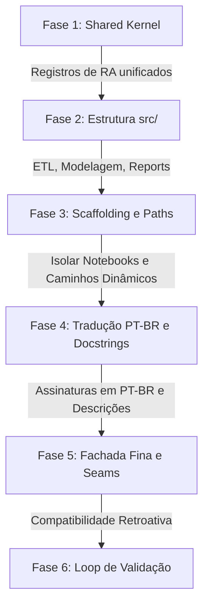

# Plano de Refatoração Modular e Tradução do Pipeline de Dengue

Este documento fornece um plano passo a passo cronológico com prompts estruturados para que um agente de IA execute de forma autônoma a refatoração do monolito [executar_plano_prompts_opus.py](file:///c:/arbodf/DocML/scripts/executar_plano_prompts_opus.py) para uma arquitetura modular limpa sob a pasta `src/`.

---

## 📅 Visão Geral da Sequência de Refatoração



---

## 📝 Prompt 1: Unificação do Shared Kernel (Fase 1)

**Objetivo:** Resolver a divergência crítica de acentuação na normalização das Regiões Administrativas entre [dengue_radf.py](file:///c:/arbodf/DocML/dengue_radf.py) e [executar_plano_prompts_opus.py](file:///c:/arbodf/DocML/scripts/executar_plano_prompts_opus.py).

```markdown
Você é um engenheiro de software sênior encarregado de extrair o "Shared Kernel" do projeto de modelagem de dengue. 

Sua primeira tarefa é resolver a divergência na normalização das Regiões Administrativas (RAs):
- No arquivo `dengue_radf.py:17`, a função `normalize_ra` utiliza mapeamentos estáticos acentuados (ex: 'CEILÂNDIA', 'GUARÁ').
- No arquivo `executar_plano_prompts_opus.py:158`, a função `normalize_ra` utiliza os nomes canônicos não-acentuados extraídos de `populacao_historica.csv` (ex: 'CEILANDIA', 'GUARA').

Execute os seguintes passos cirúrgicos:
1. Crie o diretório `src/dengue_pipeline/shared_kernel/` caso não exista.
2. Crie o arquivo `src/dengue_pipeline/shared_kernel/ra_registry.py`. Insira nele uma função que carregue dinamicamente `populacao_historica.csv` para normalizar strings, mas implemente um fallback inteligente: se o arquivo não estiver disponível, use um mapeamento estático normalizado em maiúsculo E sem acento para garantir que todos os joins epidemiológicos e demográficos funcionem perfeitamente.
3. Crie o arquivo `src/dengue_pipeline/shared_kernel/epi_calendar.py` contendo a função `epi_sunday` (extraída de `executar_plano_prompts_opus.py:68`) para unificar o cálculo dos domingos epidemiológicos e ciclos de sazonalidade senoidal/cossenoideais.
4. Escreva testes unitários rápidos ou execute um script no ambiente de testes para validar que ambas as funções normalizam e alinham os dados de forma idêntica.
```

---

## 📝 Prompt 2: Extração dos Bounded Contexts em `src/` (Fase 2)

**Objetivo:** Desmembrar o monolito [executar_plano_prompts_opus.py](file:///c:/arbodf/DocML/scripts/executar_plano_prompts_opus.py) em submódulos coesos sob a pasta `src/dengue_pipeline/`.

```markdown
Você deve agora extrair as responsabilidades do monolito `executar_plano_prompts_opus.py` em submódulos bem definidos dentro de `src/dengue_pipeline/`. 

Importe o Shared Kernel unificado que criamos na Fase 1 para substituir as computações locais de RA e datas.

Crie a seguinte estrutura física de arquivos:

1. `src/dengue_pipeline/etl/case_ingestion.py`:
   - Copie e adapte as funções `read_info_saude` e `target_masks`.
   - Garanta que a ingestão dependa de tipos explícitos de DataFrame.

2. `src/dengue_pipeline/etl/weather_ingestion.py`:
   - Copie e adapte as funções `load_climate`.

3. `src/dengue_pipeline/modeling/feature_engineering.py`:
   - Copie e adapte `build_processed_dataset`, `feature_spec` e `prepare_design`.

4. `src/dengue_pipeline/modeling/train_tuning.py`:
   - Copie e adapte `split_train_test`, `model_factory`, `predict_cases`, `cv_score_params`, `tune_models` e `run_rolling_validation`.

5. `src/dengue_pipeline/modeling/evaluation.py`:
   - Copie e adapte `run_ablation_tests` e `aggregate_metrics`.

6. `src/dengue_pipeline/reporting/report_writer.py`:
   - Copie e adapte `make_eda_figures`, `make_ablation_figures`, `make_final_visuals` e as visualizações da validação SINAN (`validate_sinan_infosaude`).

Regras Estritas:
- Nenhum desses arquivos sob `src/` deve ter acoplamento com rotinas físicas de escrita de arquivos JSON de notebooks ou reescrita direta de Markdown. Eles devem focar puramente em sua lógica de negócios correspondente e retornar estruturas de dados ou objetos para os chamadores.
- Substitua todos os imports de funções internas locais pelos caminhos modulares relativos (ex: `from dengue_pipeline.shared_kernel.ra_registry import ...`).
```

---

## 📝 Prompt 3: Isolamento de Scaffolding e Paths Dinâmicos (Fase 3)

**Objetivo:** Remover as lógicas de infraestrutura do pipeline e substituir caminhos de diretório absolutos.

```markdown
Precisamos remover as responsabilidades de scaffolding do pipeline preditivo e corrigir a fragilidade dos caminhos de diretório físicos:

1. Crie o arquivo `src/dengue_pipeline/utils/scaffold.py`:
   - Mova para lá as funções `notebook_cell()`, `write_notebook()`, `write_notebooks()` e `update_notebook_index()` presentes na linha 1058 em diante de `executar_plano_prompts_opus.py`.
2. Resolva a fragilidade de caminhos absolutos:
   - No arquivo `scaffold.py`, substitua o caminho hardcoded `C:/arbodf/DocML` (linhas 1093 e 1111) por buscas dinâmicas baseadas em caminhos relativos. Use `Path(__file__).resolve().parents[3]` (ou o nível correto do repositório) para detectar dinamicamente a pasta raiz do projeto em qualquer máquina onde o script for rodado.
```

---

## 📝 Prompt 4: Tradução de Assinaturas de Funções para PT-BR e Documentação (Fase 4)

**Objetivo:** Renomear todas as funções do pipeline para Português (Brasil) para manter a coerência de nomenclatura com o domínio epidemiológico local, adicionando docstrings descritivas.

```markdown
Para facilitar a leitura do código por equipes locais de vigilância epidemiológica e manter o alinhamento com a Ubiquitous Language do projeto, traduza todas as assinaturas de funções públicas e internas dentro do diretório `src/dengue_pipeline/` para o Português (Brasil).

Exemplos de mapeamento de nomes de funções:
* `run_prompt1_target_analysis` ➔ `executar_analise_target`
* `build_processed_dataset` ➔ `construir_dataset_processado`
* `run_rolling_validation` ➔ `executar_validacao_rolling`
* `run_ablation_tests` ➔ `executar_testes_ablacao`
* `tune_models` ➔ `tunar_modelos`
* `make_final_visuals` ➔ `gerar_visualizacoes_finais`
* `validate_sinan_infosaude` ➔ `validar_sinan_infosaude`
* `predict_cases` ➔ `prever_casos`
* `epi_sunday` ➔ `domingo_epidemiologico`
* `load_population_history` ➔ `carregar_historico_populacao`

Adicionalmente, adicione uma Docstring concisa (de 2 a 3 linhas) em formato padrão para todas as funções traduzidas, explicando:
1. O que a função recebe e o que ela faz.
2. O que ela retorna.
3. Quaisquer premissas críticas assumidas.
```

---

## 📝 Prompt 5: Criação da Fachada de Compatibilidade Retroativa (Fase 5)

**Objetivo:** Substituir a implementação do monolito antigo por uma Fachada Fina (Thin Facade) que preserve as assinaturas originais exigidas pelos notebooks do usuário.

```markdown
Crie uma fachada de transição segura no arquivo `scripts/executar_plano_prompts_opus.py` usando o Strangler Fig Pattern:

1. Sobrescreva o arquivo `scripts/executar_plano_prompts_opus.py` por completo.
2. Remova todo o código interno procedural antigo.
3. Importe os novos submódulos criados em `src/dengue_pipeline/` que contêm as lógicas de ETL, modelagem e visualização traduzidas para português.
4. Mantenha no arquivo `executar_plano_prompts_opus.py` as mesmas assinaturas e nomes de funções em inglês que eram expostos originalmente (como `run_prompt1_target_analysis`, `build_processed_dataset`, etc.).
5. Dentro dessas funções de fachada, simplesmente delegue a execução chamando as correspondentes funções traduzidas em português sob a pasta `src/` (ex: chamar `executar_analise_target()` por trás da chamada de `run_prompt1_target_analysis()`).

Esta fachada garante que os notebooks do usuário (dengue_analise_modelagem.ipynb e validacao_sinan_infosaude.ipynb) continuem funcionando perfeitamente sem quebrar e sem exigir nenhuma modificação imediata do código pelo usuário.
```

---

## 📝 Prompt 6: Validação Robusta e Loop Auto-Corretivo (Fase 6)

**Objetivo:** Executar o pipeline programaticamente, inspecionar erros e validar saídas recursivamente até que o pipeline rode limpo e estável.

```markdown
Você deve agora atuar como o validador final do processo de refatoração modular.

Siga rigorosamente a seguinte rotina auto-corretiva em loop até que 100% dos testes passem:

1. **Executar Pipeline:**
   Proponha e execute o comando no terminal do workspace para rodar o script de fachada:
   `python scripts/executar_plano_prompts_opus.py`
   
2. **Avaliar Logs de Erro:**
   - Se ocorrer qualquer exceção (como `ModuleNotFoundError`, `ValueError`, `KeyError` ou falhas de importação de caminhos), pare, inspecione a pilha de erro de forma cirúrgica e corrija o arquivo correspondente na estrutura modular.
   - Se houver alertas ou warnings sobre joins perdidos devido a nomes acentuados de RAs, revise o `ra_registry.py` e garanta que todas as strings de entrada passem pela normalização unificada sem acentuação.
   
3. **Verificar Resultados de Saída:**
   Verifique se os seguintes arquivos continuam sendo gerados na raiz do repositório com dados idênticos e válidos:
   - `dataset_processado.parquet`
   - `rolling_validation_resultados.csv` (Valores de R² aproximados a 0.720 para Nowcasting e 0.521 para Forecast)
   - `resultados_ablation.csv`
   - `resultados_tuning.csv`
   
4. **Iteração:**
   Repita o passo de execução e correção recursivamente. Não pare até que o script execute de ponta a ponta sem nenhum erro no terminal, imprimindo ">>> Plano executado com sucesso." ao final.
```
