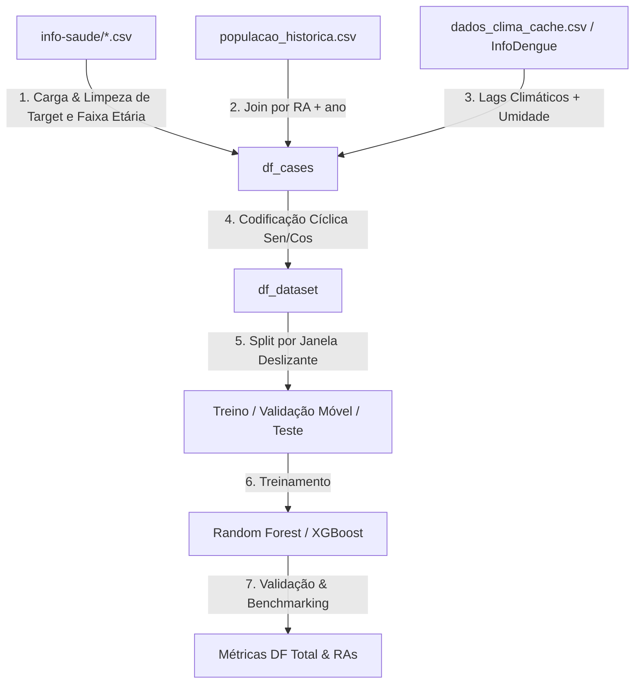

# TDD - Pipeline de Análise, Limpeza e Modelagem Preditiva de Dengue

| Campo           | Valor |
| --------------- | ------------------------------------- |
| Tech Lead       | @Antigravity |
| Team            | @Roger (Developer) |
| Epic/Ticket     | [Jira-DocML-002](https://jira.com) |
| Status          | REVISADO |
| Created         | 2026-05-24 |
| Last Updated    | 2026-05-24 (revisão crítica `revisao-plano-repositorio-2026-05-24.md`) |

---

## 1. Contexto

A dengue é uma das principais arboviroses tropicais que afetam a saúde pública no Distrito Federal (DF). 

Para apoiar a tomada de decisões de saúde pública, o projeto DocML visa construir modelos preditivos baseados em dados climáticos e dados epidemiológicos georreferenciados no DF. 

O repositório dispõe de arquivos consolidados de dados epidemiológicos locais (`info-saude/`) e dados climáticos obtidos via cache ou download. 

Para estruturar e garantir a reprodutibilidade e reprocessabilidade dos modelos, este projeto propõe a criação de um **Jupyter Notebook de ponta a ponta** para a limpeza, exploração, preparação e treinamento preditivo.

---

## 2. Definição do Problema e Motivação

### Problemas Resolvidos
1. **Falta de Exploração Visual e Interativa:** A ausência de um Jupyter Notebook dificulta a visualização exploratória da dispersão de casos, anomalias e gráficos de correlação.
2. **Defasagem e Viés Demográfico:** A base populacional estática subestimava as taxas de incidência históricas reais. A criação de `populacao_historica.csv` resolve isso, mas sua integração não é opcional — é **pré-requisito** para qualquer uso de RA como feature preditora (sem ela, a taxa de incidência carrega viés demográfico estrutural).
3. **Data Leakage (Vazamento de Lags) e Ambiguidade de Modo de Validação:** `dengue_radf.py` calcula `cases_lag_1..4` em toda a série *antes* do split treino/teste. No período de avaliação 2025/2026, o modelo acessa casos reais de semanas futuras, o que é aceitável para **nowcasting rolling** (previsão semana a semana operacional), mas **não** para declarar um **forecast fechado** de 52 semanas a partir de uma data fixa. Esta distinção precisa ser documentada e implementada explicitamente em cada célula do notebook.
4. **Ausência de Ablation e Baseline Formal:** A revisão crítica identificou que o baseline naive `cases_lag_1` (R² ≈ 0.697) quase empata com Random Forest (R² ≈ 0.703) e supera XGBoost (R² ≈ 0.684). Sem ablation tests, é impossível demonstrar que features climáticas, de RA e populacionais agregam valor real.
5. **Target Não Formalizado:** O filtro atual usa apenas `i_class_final == 'Caso Provável'`, ignorando `i_desc_classificacao`. A presença de registros `Inconclusivo`/`Não Informado` no subconjunto de prováveis pode mudar a série alvo de forma significativa.

## 3. Escopo

### ✅ In Scope (V1 - MVP)
- Criação do Jupyter Notebook `dengue_analise_modelagem.ipynb` contendo a estruturação completa e interativa do pipeline.
- Seleção e Limpeza do Target: Isolamento estrito da coluna de target `i_class_final == 'Caso Provável'` e mapeamento descritivo.
- Preservação da **Faixa Etária (`i_faixa_etaria`)**: Mantida explicitamente no dataset como um preditor de risco clínico essencial para o modelo, com tratamento de agrupamento seguro contra vazamentos de dados sensíveis individuais.
- Integração da nova base dinâmica [populacao_historica.csv](file:///c:/arbodf/DocML/populacao_historica.csv).
- Geração da série temporal baseada na **População Absoluta do Distrito Federal** (benchmark demográfico global agregando todas as RAs) para validação retrospectiva e neutralização do paradoxo geopolítico de novas RAs.
- Inclusão dos **Lags de Umidade Relativa** (`umidmed`, `umidmin`, `umidmax`) obtidos do InfoDengue/NASA, integrados às features junto com temperatura e chuva.
- **Codificação Cíclica Tridimensional:** Transformação trigonométrica de `week_of_year` e `month` em funções de **Seno e Cosseno** para capturar a continuidade e transições sazonais de forma cíclica.
- **Formalização do Target (P0):** Decisão documentada sobre os filtros `i_class_final == 'Caso Provável'` **E** `i_desc_classificacao == 'Dengue'`, com comparação volumétrica das séries antes e após o filtro duplo.
- Estratégia de validação temporal por **Janela Deslizante (Sliding Window / Rolling Forecast)** com cálculo de lags **dentro de cada fold** (sem data leakage). Documentação explícita do modo (nowcasting vs. forecast fechado).
- **Ablation Tests (4 configurações sequenciais):**
  1. `lag-only` — baseline formal com `cases_lag_1..4` apenas.
  2. `lag + clima` — adiciona precipitação, temperatura e umidade com lags.
  3. `lag + clima + RA` — adiciona codificação das Regiões Administrativas.
  4. `lag + clima + RA + população` — adiciona taxa por 100k com `populacao_historica.csv`.
- Treinamento dos modelos Random Forest e XGBoost Regressors.
- Avaliação contra métricas globais e locais por RA (MAE, RMSE, R²), com R² do ablation `lag-only` como **linha de corte mínima de aceitação**.

### ❌ Out of Scope (V1)
- Modelagem baseada em Redes Neurais recorrentes LSTM ou GRU (será tratada na V2, usando a codificação de seno/cosseno desenvolvida nesta fase).
- Reconciliação hierárquica baseada no Nixtla (`dengue.py`) (mantido apenas como referência benchmark).

---

## 4. Solução Técnica

### Arquitetura de Componentes
O pipeline estruturado dentro do notebook seguirá o seguinte fluxo de dados unidirecional:

### Protocolo de Validação de Dados (Cleaning Contracts)
*   **Filtro Clave:** Apenas registros onde `i_class_final == 'Caso Provável'` e `i_desc_classificacao == 'Dengue'` devem ser mantidos.
*   **Campos Nulos:** Registros sem a Região Administrativa preenchida (`i_desc_radf_res == 'Não Informado'` ou `NaN`) ou sem data de sintomas válida serão descartados antes da agregação.
*   **Semana Epidemiológica:** Todas as agregações temporais de casos serão feitas agrupando as datas pelo domingo epidemiológico correspondente (`epi_sunday`), utilizando a fórmula:
    `df['epi_sunday'] = df['date'] - pd.to_timedelta((df['date'].dt.weekday + 1) % 7, unit='D')`

### Engenharia de Features Avançada
1.  **Variáveis Cíclicas (Seno/Cosseno):**
    Para evitar que o modelo interprete a semana 53 como distante da semana 1 (sendo que são consecutivas cronologicamente), aplicamos as fórmulas:
    $$\sin\_week = \sin\left(\frac{2 \pi \times \text{week\_of\_year}}{53}\right), \quad \cos\_week = \cos\left(\frac{2 \pi \times \text{week\_of\_year}}{53}\right)$$
    $$\sin\_month = \sin\left(\frac{2 \pi \times \text{month}}{12}\right), \quad \cos\_month = \cos\left(\frac{2 \pi \times \text{month}}{12}\right)$$
2.  **Variáveis de Risco Demográfico:**
    Inclusão da `i_faixa_etaria` codificada via One-Hot Encoding ou ordinal, representando a vulnerabilidade específica de cada extrato.
3.  **Lags de Clima Ampliado:**
    Lags de 2 a 8 semanas da umidade média (`umid_mean_lag_x`), precipitação (`precip_lag_x`) e temperaturas.

### Estrutura do Dataset Final (Features Schema)
*   **Identificadores:** `epi_sunday` (datetime), `RA` (string), `ano` (int).
*   **Target:** `target_log` = `log1p(cases)`.
*   **Clima:** Lags de 2 a 8 semanas para precipitação, temperatura e umidade relativa.
*   **Variáveis Auto-regressivas (Casos):** `cases_lag_1` a `cases_lag_4` (agrupados rigorosamente por `RA` antes do shift).
*   **Cíclicas:** `sin_week`, `cos_week`, `sin_month`, `cos_month`.
*   **Demográficas:** `i_faixa_etaria` codificada.
*   **Codificação Espacial:** One-Hot Encoding das Regiões Administrativas.

---

## 5. Riscos e Mitigações

| Risco | Impacto | Probabilidade | Mitigação |
| :--- | :---: | :---: | :--- |
| **Data Leakage nos Lags** | ALTO | ALTA | Calcular todos os lags auto-regressivos **dentro de cada fold** da janela deslizante, agrupados por RA (`groupby('RA')`), nunca sobre a série completa antes do split. |
| **Paradoxo das Novas RAs** | MÉDIO | ALTA | Utilizar o benchmark de **População Absoluta do DF** para certificar que o desmembramento das RAs não inviabilize a análise de tendências históricas de longo prazo (2017-2026). |
| **Overfit no Outlier de 2024** | ALTO | MÉDIA | Abandonar validação estática em 2024 em favor da validação temporal por **Janela Deslizante (Rolling Forecast)**. |
| **Baseline naive supera modelos complexos** | ALTO | ALTA | Executar ablation tests antes de tunar hiperparâmetros. Se `lag-only` superar `lag+clima+RA+pop`, revisar definição de target e qualidade das features antes de prosseguir. |
| **Incompatibilidade SINAN nacional vs. info-saude local** | ALTO | MÉDIA | Antes de qualquer reconciliação hierárquica nacional→RA (Opção B), validar compatibilidade temporal e semântica entre as duas fontes. Não misturar séries sem prova de equivalência. |

---

## 6. Considerações de Segurança e LGPD

> [!CAUTION]
> Os dados epidemiológicos do `info-saude` contêm informações de saúde de indivíduos do Distrito Federal (faixa etária, sexo, raça, desfechos clínicos). De acordo com a **LGPD (Lei Geral de Proteção de Dados - Lei nº 13.709/2018)**:
> 
> 1. **Mantendo a Faixa Etária Seguro:** A coluna `i_faixa_etaria` é um preditor clínico de altíssimo valor (vulnerabilidade etária). Para mantê-la sem violar a LGPD, o notebook realizará a **agregação das faixas etárias** e removerá qualquer outro vetor indireto de identificação (como coordenadas de endereço ou números de prontuário), garantindo a anonimização absoluta.
> 2. **Segurança de Caminhos:** O notebook deve validar que todas as leituras de arquivos são feitas restritamente dentro do diretório do workspace (`c:\arbodf\DocML`), prevenindo falhas de travessia de diretório (*path traversal*).
> 3. **Sem Dados Clínicos Sensíveis Individuais no Git:** Arquivos CSV brutos individuais do `info-saude/` e `dados-gov/` devem estar registrados no `.gitignore` para prevenir sua exposição pública em repositórios remotos.

---

## 7. Estratégia de Testes e Validação do Modelo
*   **Validação por Janela Deslizante (Rolling Forecast):**
    O modelo será validado simulando o comportamento real em produção. Treinamos o modelo com dados até o tempo $T$, avaliamos no tempo $T+1$ (out-of-sample), e depois incorporamos $T+1$ no treino para prever $T+2$, deslizando a janela de treino recursivamente.
*   **Benchmark Populacional DF:**
    As previsões das RAs serão agregadas no nível DF e comparadas com a curva global de incidência real para certificar a estabilidade macroscópica das previsões.
*   **Métricas de Validação:**
    *   $R^2$ (Coeficiente de Determinação): Meta global: $R^2 \geq 0.80$. **Linha de corte mínima de aceitação:** o modelo final deve superar o ablation `lag-only` de forma estatisticamente significativa (delta R² > 0.05 ou melhoria consistente no RMSE por RA).
    *   MAE (Erro Médio Absoluto) e RMSE (Erro Quadrático Médio) aplicados por RA e DF total.
*   **Gráfico de Resíduos:** Plota a dispersão dos erros de previsão para verificar autocorrelação de resíduos e heterocedasticidade.
*   **Comparação de Ablation:** Tabela consolidada com R²/MAE/RMSE das 4 configurações de features (lag-only → lag+clima → lag+clima+RA → lag+clima+RA+pop) para cada modelo (RF, XGBoost) e para o DF total.
