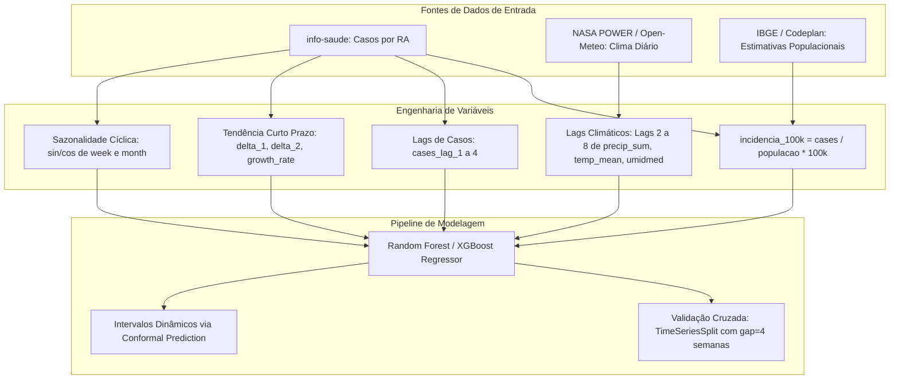

# Arbovirose Dengue DF — Pipeline Preditivo de Surtos no Distrito Federal

> Modelagem preditiva semanal de casos de **dengue** no Distrito Federal (DF) usando **Random Forest** e **XGBoost**, com validação temporal estruturada, bandas de incerteza via **Conformal Prediction Dinâmico** e análise por Região Administrativa (RA).

---

## 🗺️ Estrutura do Repositório

O projeto segue arquitetura modular por domínio, separando lógica de negócio, dados e relatórios:

```
.
├── src/dengue_pipeline/          # Pipeline principal modularizado
│   ├── etl/                      # Ingestão e transformação de dados
│   │   ├── case_ingestion.py     # Leitura e limpeza dos dados de casos (info-saude)
│   │   └── weather_ingestion.py  # Extração e cache de dados climáticos (Open-Meteo)
│   ├── modeling/                 # Núcleo de modelagem preditiva
│   │   ├── feature_engineering.py   # Engenharia de lags epidemiológicos e climáticos
│   │   ├── train_tuning.py          # Treinamento, tuning e rolling validation (RF + XGBoost)
│   │   ├── evaluation.py            # Métricas: MAE, RMSE, Winkler Score, ACF de resíduos
│   │   └── conformal_prediction.py  # Intervalos de confiança dinâmicos (Conformal Induction)
│   ├── reporting/
│   │   └── report_writer.py      # Geração de relatórios, gráficos e CSVs de saída
│   └── shared_kernel/
│       ├── epi_calendar.py       # Calendário epidemiológico (SE → data ISO)
│       └── ra_registry.py        # Registro das 33 Regiões Administrativas do DF
│
├── scripts/                      # Scripts auxiliares de coleta e utilitários
│   ├── fetch_nasa_power.py       # Requisição de dados climáticos diários — NASA POWER
│   └── gerar_populacao_historica.py  # Geração da base demográfica pós-Censo 2022
│
├── InfoDengue/                   # Série histórica semanal oficial — Fiocruz/FGV (2006–2026)
├── info-saude/                   # Dados epidemiológicos locais do DF por RA (2017–2026)
├── artigos/                      # Literatura de referência em ML e Saúde Pública
├── .notebook/                    # Base de inteligência: ADRs, RFCs, TDDs e notas de design
│
├── dengue_radf.py                # Pipeline monolítico legado de experimentação rápida
├── requirements.txt              # Dependências do projeto (Python 3.10)
└── README.md
```

> **Pastas de saída** (geradas em tempo de execução, ignoradas pelo `.gitignore`):
> `dados_processados/`, `resultados_modelagem/`, `resultados_graficos/`

---

## 🧠 Abordagem Técnica

### Modelos

- **Random Forest** e **XGBoost** treinados por série temporal de cada RA.
- **Validação cruzada temporal com gap** (`gap=4 semanas`) para evitar data leakage.
- **Ablação de features** automatizada para identificar o subconjunto ótimo de preditores.

### Features & Seleção de Variáveis (Dataset Schema)

O pipeline de modelagem consome um dataset unificado de **17.185 linhas × 51 colunas**, consolidado na granularidade de **Semana Epidemiológica × Região Administrativa (RA)**. A seleção de variáveis é justificada cientificamente pelas dinâmicas de transmissão vetorial da dengue:



| Categoria | Features Utilizadas | Justificativa Científica e Técnica |
|---|---|---|
| **Alvo (Target)** | `cases` / `incidencia_100k` | O modelo é treinado sob escala logarítmica `log1p(target)` para suavizar outliers de picos. A conversão de retorno para a escala real em produção utiliza `expm1`. |
| **Demográficas** | `populacao` (dinâmica anual) | Em vez de um denominador populacional fixo (2024), utiliza-se a série retroprojetada por RA pós-Censo 2022. Corrige o viés metodológico de subestimação da incidência histórica real. |
| **Lags Climáticos** | Lags de 2 a 8 semanas de `precip_sum`, `temp_mean`, `umidmed` | O mosquito leva semanas para nascer (chuva/umidade) e o vírus semanas para incubar (temperatura). Variáveis extremas como `temp_max`, `temp_min`, `umidmin` e `umidmax` foram **excluídas** para evitar multicolinearidade e overfitting. |
| **Lags de Casos** | Lags de 1 a 4 semanas | Captura a inércia e autocorrelação epidemiológica da série de contágio ativa por RA. |
| **Tendência de Curto Prazo** | `cases_delta_1` (lag 1 - 2), `cases_delta_2` (lag 2 - 3), `cases_growth_rate` | Fornece sinal de aceleração/desaceleração. Essencial para que modelos baseados em árvores (RF/XGB) detectem o início de surtos e evitem subestimação sistemática de picos epidêmicos. |
| **Sazonalidade Cíclica** | Seno/Cosseno de semana e mês | Codificação trigonométrica contínua anual. Evita descontinuidades numéricas artificiais (como a transição abrupta de dezembro a janeiro). |


### Conformal Prediction Dinâmico

O módulo `conformal_prediction.py` implementa bandas de incerteza **calibradas localmente e adaptativas**, resolvendo dois problemas identificados na análise de resíduos:

- **Heteroscedasticidade**: o erro cresce proporcionalmente ao volume do surto.
- **Colapso de forecast fechado**: incerteza subestimada em horizontes longos.

A margem de erro dinâmica usa a própria predição do modelo (`ŷ`) como estimador de escala:

```
score_i = |y_i − ŷ_i| / (ŷ_i + ε)       ← calibração
margin  = q_conf × (ŷ + ε) × √k          ← aplicação (k = horizonte)
```

**Resultado empírico**: melhoria de **8% no Winkler Score** (6,34 → 5,84) com cobertura empírica ≥ 90%.

---

## 🚀 Como Começar

### 1. Configurar o ambiente virtual

O projeto utiliza **Python 3.10**. Crie e ative o ambiente virtual:

```powershell
# PowerShell (Windows)
python -m venv .venv
.venv\Scripts\Activate.ps1

# Instalar dependências
pip install -r requirements.txt
```

### 2. Gerar a base de população histórica

```bash
python scripts/gerar_populacao_historica.py
```

*Saída: `dados_processados/populacao_historica.csv`*

### 3. Executar o pipeline modular

```bash
python -m dengue_pipeline
```

Ou executar o pipeline monolítico legado para prototipação rápida:

```bash
python dengue_radf.py
```

Os artefatos são distribuídos automaticamente entre:
- `dados_processados/` — features processadas e cache de clima
- `resultados_modelagem/` — modelos serializados, métricas e intervalos de confiança
- `resultados_graficos/` — gráficos de série temporal, feature importance e dispersão

---

## 📚 Base de Conhecimento (`.notebook/`)

A pasta `.notebook/` contém a inteligência acumulada do projeto em documentos estruturados:

| Documento | Tipo | Conteúdo |
|---|---|---|
| `INDEX.md` | Índice | Mapa de todas as notas do projeto |
| `bases-de-dados.md` | Referência | Estrutura das bases epidemiológicas |
| `pipeline-radf.md` | Referência | Fluxo completo do pipeline e features |
| `adr-002-uso-populacao-historica.md` | ADR | Decisão de usar população demográfica calibrada |
| `rfc-002-pipeline-dados-modelagem.md` | RFC | Proposta de pipeline estruturado interativo |
| `tdd-notebook-limpeza-modelagem.md` | TDD | Especificação técnica de limpeza e modelagem |
| `literatura-algoritmos.md` | Literatura | Síntese dos artigos de referência |

---

## 📦 Principais Dependências

| Pacote | Uso |
|---|---|
| `scikit-learn` | Random Forest, validação cruzada |
| `xgboost` | Gradient Boosting |
| `statsforecast` | AutoARIMA, AutoETS, AutoTheta |
| `pandas` / `numpy` | Manipulação de dados e vetorização |
| `matplotlib` / `seaborn` | Visualizações |

Veja a lista completa em [`requirements.txt`](requirements.txt).

---

## 📊 Fontes de Dados

| Fonte | Cobertura | Descrição |
|---|---|---|
| **Info-Saúde (SES-DF)** | 2017–2026 | Casos notificados por RA, semanais |
| **InfoDengue (Fiocruz/FGV)** | 2006–2026 | Série integrada oficial com alertas e umidade |
| **Open-Meteo** | 2016–atual | Temperatura, precipitação e umidade diárias |
| **NASA POWER** | 2006–atual | Dados climáticos históricos diários |
| **IBGE / Codeplan** | 2010–2022 | Estimativas populacionais por RA (pós-Censo 2022) |

---

## 📄 Licença

Este projeto está licenciado sob a licença MIT. Veja o arquivo [`LICENSE`](LICENSE) para mais detalhes.
