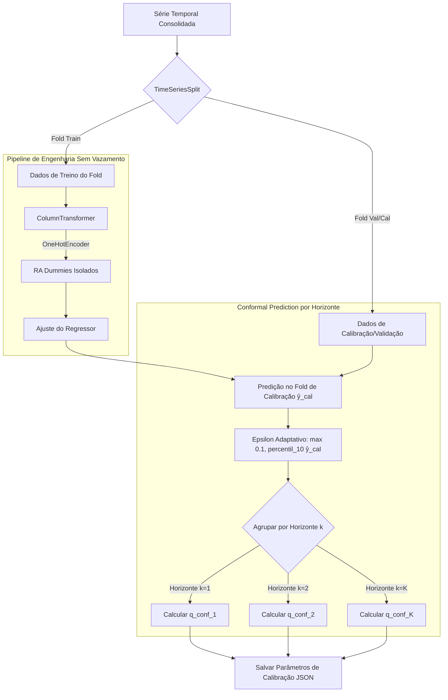
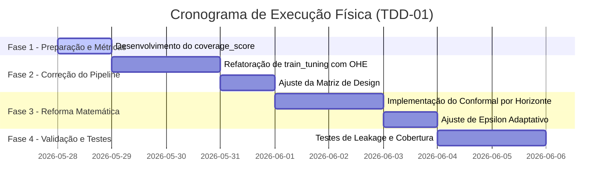

# TDD-01 - Reforma do Conformal Prediction e Prevenção de Vazamento de Dados

| Campo            | Valor                                                                                                                                                                          |
| ---------------- | ------------------------------------------------------------------------------------------------------------------------------------------------------------------------------ |
| **Tech Lead**    | @roger-quinelato                                                                                                                                                               |
| **Team**         | @roger-quinelato                                                                                                                                                               |
| **RFCs Relacionadas** | [RFC-01: Reforma CP](file:///c:/arbodf/DocML/planosImediatos/RFC-01-conformal-prediction-reforma-matematica.md), [RFC-02: Vazamento de Dados](file:///c:/arbodf/DocML/planosImediatos/RFC-02-prevencao-vazamento-dados-cv.md) |
| **Status**       | Draft                                                                                                                                                                          |
| **Criado em**    | 2026-05-27                                                                                                                                                                     |
| **Atualizado em**| 2026-05-27                                                                                                                                                                     |

---

## 1. Contexto

Este Documento de Design Técnico (TDD) unifica a reforma metodológica de dois pilares fundamentais do pipeline de modelagem preditiva da dengue no Distrito Federal (DF):
1. **Calibração de Incerteza (Conformal Prediction):** Correção de inconsistências estatísticas nas bandas de predição do módulo `conformal_prediction.py`.
2. **Ciclo de Validação sem Vazamento (Data Leakage Prevention):** Reestruturação do loop de validação cruzada (`train_tuning.py` e `feature_engineering.py`) para encapsular transformações de dados em pipelines robustos e isolados por fold.

No modelo atual, a incerteza é escalada por uma heurística de raiz temporal $\sqrt{k}$ que assume incorretamente que os erros de previsão epidemiológica são independentes e identicamente distribuídos (i.i.d.). Paralelamente, o pipeline de treino sofre de *schema leakage* devido ao pré-cálculo global de variáveis categóricas (One-Hot Encoding das Regiões Administrativas - RAs) fora do loop de validação temporal (`TimeSeriesSplit`), comprometendo a validação empírica e a validade científica das métricas reportadas em nível de pesquisa avançada (Doutorado).

A unificação dessas duas reformas em um único TDD visa construir uma arquitetura elegante baseada no padrão industrial `scikit-learn`, garantindo a imunidade estatística contra vazamento de dados ao mesmo tempo que implementa uma incerteza adaptativa calibrada especificamente por horizonte preditivo.

---

## 2. Definição do Problema e Motivação

### Problemas Resolvidos

*   **P-01: Erro de Premissa Estatística no Fator de Expansão ($\sqrt{k}$):**
    O uso de $\sqrt{k}$ assume dinâmica de passeio aleatório (Movimento Browniano). A dinâmica de propagação de doenças infecciosas é caracterizada por sistemas não-lineares determinísticos e estocásticos fortemente autocorrelacionados. Isso causa subestimação severa da incerteza para horizontes de previsão distantes ($k > 2$).
*   **P-02: Instabilidade Near-Zero no Score Proporcional:**
    O cálculo do score de não-conformidade $s_i = \frac{|y_i - \hat{y}_i|}{\hat{y}_i + \epsilon}$ com $\epsilon = 0.01$ gera scores desproporcionalmente inflados quando a incidência predita é próxima de zero ($\hat{y}_i \approx 0$). Isso causa distorção severa da calibração heterocedástica, inflando desnecessariamente as bandas de incerteza em períodos interepidêmicos.
*   **P-03: Schema Leakage (Dimensional Leakage):**
    A extração global de variáveis Dummy (`pd.get_dummies`) com base em todo o conjunto de dados expõe ao conjunto de treino informações sobre a presença futura de categorias de RAs no conjunto de teste/validação temporal.
*   **P-04: Acoplamento Frágil no Feature Engineering:**
    A ausência de encapsulamento formal das operações de preparação de dados (geração de dummies, transformações matemáticas e alinhamento de colunas) dificulta a auditoria do pipeline e a introdução de novos passos (como normalização ou tratamento de dados faltantes) sem a ocorrência de contaminação futura (*look-ahead bias*).

### Impacto de Não Agir

1.  **Vulnerabilidade Epistemológica:** Questionamentos graves em revisões por pares e bancas de doutorado sobre a validade teórica da calibração dos intervalos e a honestidade das métricas de generalização.
2.  **Métricas Otimistas Sobredimensionadas:** Intervalos de cobertura empírica que não condizem com a confiança nominal declarada (e.g., $90\%$).
3.  **Fragilidade de Código:** Risco recorrente de bugs silenciosos de vazamento de tempo à medida que novas variáveis explicativas são incorporadas.

---

## 3. Escopo

### ✅ Em Escopo (V1 - Implementação Unificada)

*   **Substituição da Heurística de Expansão:** Eliminação completa do termo estático $\sqrt{k}$ na largura da banda de incerteza.
*   **Calibração Multióptica por Horizonte (Horizon-Specific Calibration):** Implementação de quantis críticos calibrados individualmente por horizonte de projeção $k \in \{1, \ldots, K_{\text{max}}\}$.
*   **Regularizador Dinâmico Adaptativo ($\epsilon$ Adaptativo):** Substituição do valor fixo $0.01$ por um regularizador calculado de forma dinâmica a partir do percentil inferior de predições da calibração.
*   **Validador de Cobertura Empírica:** Criação de testes formais de aderência de cobertura (`coverage_score`) nas bandas.
*   **Pipeline de Engenharia com `scikit-learn`:** Encapsulamento formal de transformações usando `ColumnTransformer` e `OneHotEncoder(handle_unknown='ignore')`.
*   **Gerenciamento Matemático do Target:** Acoplamento nativo da transformação $\log(1 + y)$ via `TransformedTargetRegressor` de forma que a re-transformação $\exp(y) - 1$ seja 100% automatizada.
*   **Orquestração de Validação Nativa:** Uso integrado de `TimeSeriesSplit` integrado a buscas padrão.

### ❌ Fora de Escopo

*   Migração de modelos RF ou XGBoost para abordagens estruturais de deep learning nesta etapa.
*   Alterações na formulação fundamental da modelagem epidemiológica target.
*   Uso de bibliotecas externas complexas que exijam reconfiguração invasiva de infraestrutura de dados (optando por refatorar e formalizar de forma limpa o design matemático em código próprio ou dependências leves já mapeadas).

---

## 4. Solução Técnica

A solução adota uma arquitetura limpa em camadas integradas usando scikit-learn para garantir isolamento por fold, acoplada a um motor matemático conformal reformado.

### Visão Geral da Arquitetura

O fluxo abaixo demonstra como os dados brutos são particionados temporalmente, processados sem vazamento e calibrados usando o Conformal reformado por horizonte.



---

### Componentes Chave

#### 1. Pipeline Estrutural (`sklearn.pipeline.Pipeline`)
Substitui o processamento manual ad-hoc por um encadeamento seguro:
*   **Pré-processamento:** `ColumnTransformer` isolando dados categóricos (`RA`) e aplicando `OneHotEncoder` de forma isolada ao conjunto de treino, ignorando com segurança categorias inéditas no conjunto de teste (`handle_unknown='ignore'`).
*   **Regressão Transformada:** O modelo base (Random Forest ou XGBoost) é encapsulado pelo `TransformedTargetRegressor` usando transformações vetorizadas baseadas em `np.log1p` (treinamento) e `np.expm1` (predição automática).

#### 2. Calibração Conformal Específica por Horizonte (Horizon-Specific)
Para cada horizonte preditivo $k$, o módulo computa um quantil conformal independente:
*   Para cada previsão realizada no fold de calibração correspondente ao horizonte $k$, calcula-se o score proporcional adaptado:
    $$s_{i, k} = \frac{|y_i - \hat{y}_{i, k}|}{\hat{y}_{i, k} + \epsilon_{\text{adaptativo}}}$$
*   O quantil crítico $q_{\text{conf}, k}$ é obtido via correção empírica finita de Papadopoulos:
    $$\text{q\_level}_k = \min\left(1.0, \frac{\lceil (n_k + 1)(1 - \alpha) \rceil}{n_k}\right)$$
    $$q_{\text{conf}, k} = \text{Quantil}(S_k, \text{q\_level}_k)$$

#### 3. Estabilizador Adaptativo ($\epsilon$ Adaptativo)
Evita divisões por zero ou valores minúsculos quando a incidência predita tende a zero:
$$\epsilon_{\text{adaptativo}} = \max\left(\epsilon_{\text{min}}, \text{percentil}_{10}(\hat{y}_{\text{cal}})\right)$$
*   Onde $\epsilon_{\text{min}} = 0.1$ impede instabilidade numérica severa e $\text{percentil}_{10}$ ajusta dinamicamente a sensibilidade de escala para a base epidemiológica da série histórica daquela RA específica.

---

### Contratos de API e Estrutura de Módulos

#### Mapeamento de Modificações Operacionais

```
dengue_pipeline/
│
├── modeling/
│   ├── conformal_prediction.py  <-- Refatoração do motor conformal
│   ├── train_tuning.py          <-- Reestruturação da validação temporal (Pipeline)
│   └── feature_engineering.py   <-- Ajuste das interfaces de matriz de design
```

#### Contrato das Funções em `conformal_prediction.py`

##### 1. Calibração por Horizonte
```python
def calibrar_intervalos_confianca(
    df_calibracao: pd.DataFrame,
    alpha: float = 0.10,
    epsilon_min: float = 0.10,
) -> dict[str, any]:
    """
    Calibra os scores de não-conformidade de forma horizon-specific e adaptativa.
    
    Argumentos:
        df_calibracao: DataFrame contendo 'cases', 'prediction' e 'horizonte_k'.
        alpha: Nível de significância (e.g. 0.10 para 90% de cobertura).
        epsilon_min: Piso estabilizador mínimo para o denominador.
        
    Retorno:
        Dicionário com o epsilon adaptativo computado e uma tabela (dict) mapeando
        cada horizonte 'k' ao seu quantil empírico 'q_conf_k'.
    """
```

##### 2. Aplicação Vetorizada de Limites
```python
def aplicar_limites_confianca(
    df_forecast: pd.DataFrame,
    calibracao: dict[str, any],
) -> pd.DataFrame:
    """
    Aplica bandas conformalizadas vetorizadas utilizando lookup por horizonte preditivo.
    
    Argumentos:
        df_forecast: DataFrame contendo 'prediction' e 'horizonte_k'.
        calibracao: Metadados gerados por calibrar_intervalos_confianca.
        
    Retorno:
        DataFrame original acrescido de 'lower_ci' e 'upper_ci', com piso em 0.0.
    """
```

##### 3. Avaliação de Cobertura Empírica
```python
def avaliar_cobertura_intervalo(
    df_avaliado: pd.DataFrame,
) -> float:
    """
    Calcula a cobertura empírica real (coverage_score).
    
    Argumentos:
        df_avaliado: DataFrame contendo 'cases', 'lower_ci' e 'upper_ci'.
        
    Retorno:
        Proporção de amostras cujo valor real de 'cases' caiu dentro dos limites [lower_ci, upper_ci].
    """
```

---

### Armazenamento de Parâmetros (Schema JSON)

Os parâmetros de calibração serão persistidos no arquivo estruturado `conformal_calibration.json`:

```json
{
  "alpha": 0.1,
  "epsilon_adaptativo": 0.342,
  "quantiles_por_horizonte": {
    "1": 1.452,
    "2": 1.789,
    "3": 2.102,
    "4": 2.456
  },
  "metadata": {
    "n_total_calibration": 156,
    "data_calibracao": "2026-05-27T15:10:00"
  }
}
```

---

## 5. Riscos e Mitigações

| Risco | Impacto | Probabilidade | Mitigação |
| :--- | :--- | :--- | :--- |
| **Volatilidade Estatística por Horizonte ($n_k$ reduzido):** A divisão do conjunto de calibração por horizontes de tempo reduz o tamanho amostral de calibração para cada $k$. | **Médio** | **Médio** | Consolidar horizontes longos com comportamento homogêneo (e.g., agrupar $k > 4$ sob uma única banda representativa) se $n_k < 30$. |
| **Desalinhamento de Colunas em Teste:** O modelo falhar ao predizer dados de uma nova Região Administrativa adicionada futuramente à série de validação. | **Alto** | **Baixo** | Uso do parâmetro `handle_unknown='ignore'` do `OneHotEncoder` do scikit-learn garante geração de zeros para a nova RA de forma segura. |
| **Custos de Overhead Computacional:** O processamento interno do loop de validação cruzada do scikit-learn com múltiplas chamadas do pipeline aumentar o tempo de tuning. | **Baixo** | **Médio** | Paralelização nativa em threads usando `n_jobs=-1` no `GridSearchCV`. |
| **Instabilidade do Epsilon Adaptativo:** O percentil 10 de $\hat{y}_{\text{cal}}$ ser extremamente baixo durante secas epidemiológicas severas, aproximando $\epsilon$ de zero. | **Médio** | **Baixo** | Limite inferior físico fixado estritamente por $\epsilon_{\text{min}} = 0.10$ na função de calibração. |

---

## 6. Plano de Implementação



### Detalhamento das Tarefas

#### Fase 1: Fundação de Métricas
*   **Tarefa 1.1:** Criar e integrar a métrica `avaliar_cobertura_intervalo` em `evaluation.py`.
*   **Tarefa 1.2:** Ajustar o painel de métricas de validação para logar a cobertura real obtida versus a cobertura nominal de $90\%$.

#### Fase 2: Saneamento de Vazamento de Dados (RFC-02)
*   **Tarefa 2.1:** Migrar a geração de dummies manuais para `ColumnTransformer` e `OneHotEncoder` do `scikit-learn`.
*   **Tarefa 2.2:** Integrar o encapsulamento de treino e inferência com `sklearn.pipeline.Pipeline` e `TransformedTargetRegressor`.
*   **Tarefa 2.3:** Substituir a validação cruzada temporal ad-hoc de `train_tuning.py` por orquestradores nativos do `scikit-learn`.

#### Fase 3: Reforma Matemática do Conformal Prediction (RFC-01)
*   **Tarefa 3.1:** Remover o multiplicador $\sqrt{k}$ em `conformal_prediction.py`.
*   **Tarefa 3.2:** Desenvolver calibração individual por horizonte $k$, agrupando erros cometidos no horizonte respectivo.
*   **Tarefa 3.3:** Introduzir a lógica dinâmica do $\epsilon$ adaptativo com threshold fixado no piso $\epsilon_{\text{min}} = 0.10$.

#### Fase 4: Garantia de Qualidade e Integração
*   **Tarefa 4.1:** Desenvolver suite de testes unitários para o módulo conformal.
*   **Tarefa 4.2:** Executar rodadas completas de validação cruzada e registrar o impacto real da correção do vazamento de dados no RMSE.

---

## 7. Estratégia de Testes

### 1. Testes Unitários de Conformal Prediction
*   **Teste de Calibração Estável:** Garantir que o quantil empírico resultante da calibração resulte em cobertura empírica correta sob simulações sintéticas controladas.
*   **Teste de Cobertura Dinâmica:** Simular um surto repentino e garantir que a largura das bandas conformalizadas cresça dinamicamente acompanhando o surto.
*   **Teste de Piso do Epsilon:** Validar que mesmo sob predições nulas ($\hat{y} = 0$), o $\epsilon$ adaptativo respeita o piso de $0.10$, evitando bandas infinitas.

### 2. Testes de Imunidade a Vazamento de Dados (Leakage Checks)
*   **Teste de Dimensão Estrita:** Verificar se a matriz de design gerada em validação possui exatamente as mesmas colunas observadas em treino do fold, bloqueando a introdução de novos esquemas.
*   **Teste de Causalidade Temporal:** Garantir que nenhuma linha do conjunto de calibração correspondente a um tempo $T$ contenha lags ou estatísticas computadas com dados obtidos em tempos $T' > T$.

### 3. Critérios de Aceitação Estatística
*   **Cobertura Empírica Mínima:** A cobertura aferida por `coverage_score` em folds de teste não deve ser inferior ao nível nominal esperado por mais de um desvio aceitável (e.g., Cobertura Real $\ge 85\%$ para nível nominal de $90\%$).

---

## 8. Monitoramento e Observabilidade

*   **Logs Estruturados de Validação:** Toda rodada de treino e calibração deve registrar no arquivo de log do pipeline:
    *   O valor computado para o $\epsilon$ adaptativo.
    *   A tabela de quantis conformalizados por horizonte.
    *   A métrica consolidada de `coverage_score` global e por Região Administrativa.
*   **Métricas de Desempenho:** Acompanhamento do tempo total de execução da calibração conformal indutiva (deve permanecer abaixo de 10 segundos).

---

## 9. Plano de Rollback

*   **Ponto de Restauração Git:** O código atual de `conformal_prediction.py` e `train_tuning.py` será mantido em branch estável ou tagueado no repositório local.
*   **Fallback Paramétrico:** O pipeline suportará uma flag de compatibilidade temporária no arquivo de configuração, permitindo desativar a calibração específica por horizonte e retornar temporariamente à calibração baseada em escala global se anomalias graves de cobertura forem identificadas nas primeiras rodadas de execução.

---

## 10. Glossário e Termos de Domínio

*   **Conformal Prediction Indutivo:** Método livre de distribuição para construção de intervalos de confiança calibrados a partir de um conjunto de calibração independente.
*   **Exchangeability (Permutabilidade):** Pressuposto matemático enfraquecido em séries temporais epidemiológicas que exige cuidados (como o Horizon-Specific) para garantir a integridade estatística dos quantis.
*   **Schema Leakage:** Vazamento de estrutura dimensional futura (e.g., categorias de RAs) para fases anteriores do ciclo de treino do fold.
*   **Target Transformation:** Operação matemática de normalização e estabilização de variância aplicada ao target epidemiológico antes do treinamento da árvore de decisão.
