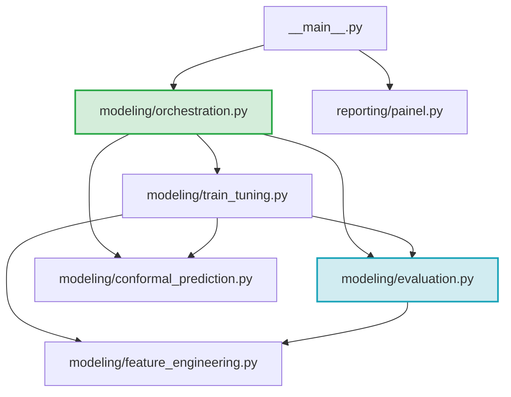

# TDD-03 - Desacoplamento de Dependências Circulares e Separação de Domínios

| Campo            | Valor                                                                                                                                                                          |
| ---------------- | ------------------------------------------------------------------------------------------------------------------------------------------------------------------------------ |
| **Tech Lead**    | @roger-quinelato                                                                                                                                                               |
| **Team**         | @roger-quinelato                                                                                                                                                               |
| **RFC Relacionada**| [RFC-03: Desacoplamento de Dependências Circulares](file:///c:/arbodf/DocML/planosImediatos/RFC-03-desacoplamento-dependencias-circulares.md)                                |
| **Status**       | Draft                                                                                                                                                                          |
| **Criado em**    | 2026-05-27                                                                                                                                                                     |
| **Atualizado em**| 2026-05-27                                                                                                                                                                     |

---

## 1. Contexto

Este Documento de Design Técnico (TDD) estabelece o plano estrutural para eliminar o acoplamento circular existente entre as camadas de **treinamento/ajuste de modelos** e **avaliação/métrica de performance**. 

Atualmente, o módulo `train_tuning.py` (responsável pelo ajuste do regressor e validação temporal) e o módulo `evaluation.py` (responsável pelo cálculo de erros e métricas) sofrem de uma dependência circular recíproca. Para mitigar esse problema temporariamente, o codebase recorre a importações preguiçosas (*lazy imports* ou *inline imports*) dentro de diversas funções. Embora isso previna erros imediatos de inicialização do interpretador Python, mascara a violação dos limites de responsabilidade dos componentes, gerando um grafo de dependências cíclico e frágil, dificultando a realização de testes unitários isolados e violando o Princípio de Inversão de Dependência (DIP) e o Princípio de Responsabilidade Única (SRP).

A solução aqui detalhada propõe a criação de uma camada dedicada de **Orquestração** (`orchestration.py`) que atuará como uma ponte limpa e funcional de via única, limpando as responsabilidades de modelagem e avaliação para que se tornem importáveis de forma 100% isolada e idempotente.

---

## 2. Definição do Problema e Motivação

### Problemas Resolvidos

*   **P-01: Dependência Circular Recíproca (`train_tuning.py` ↔ `evaluation.py`):**
    *   `train_tuning.py` (nas funções `executar_ajuste_previsao`, `cv_score_parametros` e `executar_validacao_temporal`) necessita importar `consolidar_metricas_performance` e `calcular_erro_quadratico_medio` de `evaluation.py`.
    *   `evaluation.py` (na função `executar_estudo_ablacao`) necessita importar `executar_ajuste_previsao` de `train_tuning.py`.
*   **P-02: Uso de Imports Lazy como Remendo de Arquitetura:**
    O código esconde o acoplamento realizando importações no corpo das funções, o que fragmenta a legibilidade, prejudica ferramentas de análise estática (como linters, mypy) e impossibilita a importação e o teste automatizado e isolado de funções de métricas puro sem disparar indiretamente dependências de modelagem complexas.
*   **P-03: Violação do Single Responsibility Principle (SRP):**
    O módulo `evaluation.py` acumula duas responsabilidades conflitantes:
    1.  *Avaliação Pura:* Funções matemáticas de cálculo de métricas (R², MAE, RMSE, cobertura).
    2.  *Processo de Ablação (Fluxo Experimental):* Orquestração de treino recursivo sob múltiplas combinações e persistência física de resultados CSV.

### Impacto de Não Agir

*   **Bloqueio de Extensibilidade:** Dificuldade exponencial em introduzir novos validadores ou trocar componentes do pipeline de dados sem quebrar caminhos de importações secundárias.
*   **Testabilidade Comprometida:** Inviabilidade de testar funções de avaliação pures em testes de CI sem carregar a totalidade do ecossistema de treinamento de modelos (que exige bibliotecas pesadas como XGBoost, Joblib, Scikit-Learn).
*   **Complexidade de Manutenção:** Fragilidade a erros silenciosos de importação (`ImportError` ou `AttributeError`) em caso de refatorações de nomes ou reordenação de imports.

---

## 3. Escopo

### ✅ Em Escopo (Quebra do Ciclo)

*   **Criação do Módulo de Orquestração:** Criação de `src/dengue_pipeline/modeling/orchestration.py` dedicado a fluxos que exigem conciliação entre treinamento e avaliação.
*   **Migração de Responsabilidades Cruzadas:**
    *   Mover a função `executar_estudo_ablacao` de `evaluation.py` para `orchestration.py`.
    *   Mover a função `executar_validacao_temporal` (validação rolling) de `train_tuning.py` para `orchestration.py`.
*   **Saneamento de Importações:** Substituição de todos os imports *lazy* internos por imports estáticos no topo de cada módulo, garantindo que `evaluation.py` tenha zero dependências em relação a `train_tuning.py` e `orchestration.py`.
*   **Manutenção da Retrocompatibilidade:** Exportação transparente das funções migradas através do `__init__.py` do pacote `modeling` para manter intacto o fluxo em `__main__.py` e evitar *breaking changes* de API pública.

### ❌ Fora de Escopo

*   Refatoração de pipelines de ETL fora do pacote `modeling` (como a pasta `etl/`).
*   Reescrever a lógica interna matemática das métricas ou mudar hiperparâmetros e estimadores do modelo de previsão.

---

## 4. Solução Técnica

A solução baseia-se em reestruturar as dependências do pacote de modelagem em uma estrutura estritamente hierárquica e acíclica (Directed Acyclic Graph - DAG).

### Grafo de Dependências e Fluxo de Importações (DAG)

O diagrama de fluxo abaixo demonstra a nova arquitetura limpa de importações, eliminando totalmente qualquer ciclo bidirecional:



---

### Componentes Chave

#### 1. Novo Componente: `orchestration.py` (Camada de Coordenação)
Este módulo é o único ponto que tem permissão para importar simultaneamente ferramentas de treino (`train_tuning.py`) e ferramentas de avaliação (`evaluation.py`). Ele encapsulará:
*   `executar_estudo_ablacao(df, run_dir)`: Conduz o experimento de ablação iterando sobre combinações de features/modelos, chamando o executor de treino e avaliando os DataFrames resultantes.
*   `executar_validacao_temporal(df, run_dir)`: Conduz a validação temporal rolling, acionando o treinamento em folds, as predições recursivas do modelo base, a calibração conformal e a posterior consolidação de métricas.

#### 2. Componente Funcional Puro: `evaluation.py`
Será inteiramente limpo de imports de modelagem. Suas responsabilidades são estritamente funcionais:
*   Receber arrays NumPy ou DataFrames de predição prontos (estruturas de dados inertes).
*   Calcular métricas estatísticas de erro (RMSE, R², sMAPE, MAE, cobertura empírica).
*   Não possui conhecimento de *como* os DataFrames de predição foram gerados (RF, XGB, redes neurais ou séries temporais clássicas).

#### 3. Componente de Modelagem: `train_tuning.py`
Continua com a responsabilidade de gerenciar o treinamento, hiperparâmetros e inferência preditiva:
*   Pode importar livremente `evaluation.py` estaticamente no topo do arquivo (e.g. para computar pontuações de validação cruzada temporal em `cv_score_parametros`).
*   Não importa de forma alguma `orchestration.py`.

---

### Contratos de API e Estrutura de Módulos

Para manter compatibilidade absoluta de API com os chamadores externos (como `__main__.py` e scripts legados), a exportação do módulo `__init__.py` do pacote de modelagem será reconfigurada.

#### Assinaturas de Importação no `modeling/__init__.py`

```python
# dengue_pipeline/modeling/__init__.py

# 1. Importações de Engenharia de Features
from dengue_pipeline.modeling.feature_engineering import (
    construir_dataset_consolidado,
    obter_configuracao_features,
    preparar_matriz_design
)

# 2. Importações de Modelagem e Treino Puros
from dengue_pipeline.modeling.train_tuning import (
    dividir_treino_teste_temporal,
    fabrica_modelos,
    prever_casos_recursivo,
    executar_ajuste_previsao,
    cv_score_parametros,
    otimizar_hiperparametros
)

# 3. Importações de Avaliação Pura
from dengue_pipeline.modeling.evaluation import (
    calcular_r2_robusto,
    calcular_erro_quadratico_medio,
    avaliar_cobertura_intervalo,
    consolidar_metricas_performance
)

# 4. Importações de Orquestração Unificada (Funções de coordenação movidas)
from dengue_pipeline.modeling.orchestration import (
    executar_estudo_ablacao,
    executar_validacao_temporal
)

# 5. Importações de Incerteza Conformal
from dengue_pipeline.modeling.conformal_prediction import (
    calibrar_intervalos_confianca,
    aplicar_limites_confianca,
    salvar_calibracao,
    carregar_calibracao
)

# Aliases mantidos intactos para retrocompatibilidade
executar_validacao_rolling = executar_validacao_temporal
executar_testes_ablacao = executar_estudo_ablacao
```

---

## 5. Riscos e Mitigações

| Risco | Impacto | Probabilidade | Mitigação |
| :--- | :--- | :--- | :--- |
| **Breaking Changes Silenciosos na API Interna:** Variáveis globais de caminho (como `ABLATION_CSV` ou `WINNER_JSON`) estarem acopladas fisicamente a importações no módulo errado. | **Médio** | **Médio** | Centralizar caminhos de escrita física usando o módulo global `config.py` (de acordo com a decisão de design da RFC-05). |
| **Múltiplos Ciclos Indiretos de Importação:** Outros módulos do ecossistema importarem indiretamente `train_tuning` e dispararem o interpretador de forma cíclica. | **Alto** | **Baixo** | Inclusão de testes automatizados de importabilidade estrita e auditoria do grafo completo via análise estática pós-implementação. |
| **Conflitos de Fusão de Branch:** Alterações paralelas em `train_tuning.py` em andamento concorrerem com a exclusão em massa das linhas de importação lazy. | **Médio** | **Alto** | Realizar a refatoração como passo atômico prévio a modificações profundas nas lógicas internas de conformal e OHE. |

---

## 6. Plano de Implementação

### Cronograma de Atividades

1.  **Fase 1: Mapeamento de Cruzamento (Dia 1)**
    *   Identificar dependências e variáveis de arquivo compartilhadas entre `train_tuning.py` e `evaluation.py`.
2.  **Fase 2: Criação do Orquestrador (Dia 1-2)**
    *   Criar o arquivo `orchestration.py` vazio e configurar o esqueleto de imports.
3.  **Fase 3: Migração de Funções (Dia 2)**
    *   Recortar `executar_estudo_ablacao` de `evaluation.py` e colar em `orchestration.py`.
    *   Recortar `executar_validacao_temporal` de `train_tuning.py` e colar em `orchestration.py`.
    *   Ajustar e declarar explicitamente todos os imports estáticos no topo de `orchestration.py`.
4.  **Fase 4: Saneamento e Limpeza (Dia 3)**
    *   Remover todos os `lazy imports` internos de `train_tuning.py` e `evaluation.py`.
    *   Substituir por imports estáticos limpos no topo de cada arquivo correspondente.
5.  **Fase 5: Retrocompatibilidade (Dia 3)**
    *   Reconfigurar `modeling/__init__.py` mapeando as origens corretas das funções migradas e seus respectivos aliases públicos.
6.  **Fase 6: Verificação de Ciclos e Testes (Dia 4)**
    *   Executar testes integrados de ponta a ponta e garantir a integridade da pipeline.

---

## 7. Estratégia de Testes

### 1. Testes de Ciclo Estático (Static Importability Check)
Para garantir que a dependência circular foi mitigada de forma permanente, deve-se rodar scripts isolados no interpretador verificando a independência:

```bash
# Deve importar a camada de avaliação em um processo limpo em menos de 0.5s e sem erro
python -c "import dengue_pipeline.modeling.evaluation"

# Deve importar a camada de treino sem carregar o orquestrador
python -c "import dengue_pipeline.modeling.train_tuning"
```

### 2. Teste Automatizado de Carga Unitária Isolada
Implementar um caso de teste em PyTest que valida a importabilidade isolada de `evaluation.py` sem a presença do interpretador XGBoost ou Joblib (caso o ambiente final do executor de métricas seja enxuto):

```python
def test_evaluation_imports_isolated():
    """Garante que importar o módulo de avaliação não introduz train_tuning no namespace."""
    import sys
    
    # Remove módulos se já carregados para simular isolamento
    sys.modules.pop("dengue_pipeline.modeling.train_tuning", None)
    sys.modules.pop("dengue_pipeline.modeling.orchestration", None)
    
    import dengue_pipeline.modeling.evaluation
    
    # Assert
    assert "dengue_pipeline.modeling.train_tuning" not in sys.modules
```

### 3. Teste de Sanidade de Pipeline Integrado
*   Executar o pipeline completo por linha de comando (`python -m dengue_pipeline`) verificando se os passos de Validação Temporal (Passo 4) e Teste de Ablação (Passo 5) executam e salvam os resultados Parquet, CSV e JSON nos locais configurados corretos, sem falha.

---

## 8. Monitoramento e Observabilidade

*   **Rastreabilidade de Exceções:** Ao desacoplar os módulos, as stacktraces de exceções que ocorrem durante o loop de ablação ou validação temporal serão exibidas de forma clara com origem em `orchestration.py`, facilitando o mapeamento rápido do erro em comparação com stacktraces geradas sob imports circulares dinâmicos.
*   **Controle de Tempo de Importação:** Monitorar se o tempo de importação geral do pacote encolheu ao carregar apenas subprocessos simplificados de métricas pures.

---

## 9. Plano de Rollback

*   **Restauração por Branch Git:** Criar branch de refatoração isolado (`feature/decouple-imports`). Em caso de falhas de compatibilidade não previstas, o rollback consiste simplesmente em descartar a branch ou reverter os commits atômicos de movimentação de arquivos.
*   **Preservação das Assinaturas Legadas:** As assinaturas das funções não sofrerão nenhuma mudança de parâmetros de entrada ou retorno, garantindo que qualquer dependência de escrita legada (seja em visualizadores ou geradores de tabelas) continue a funcionar normalmente se a importação transcorrer corretamente pelo `__init__.py`.

---

## 10. Alternativas Consideradas

*   **Alternativa 1: Mover utilitários para `shared_kernel` (Opção 2 do RFC):**
    *   *Racional:* Mover `calcular_erro_quadratico_medio` para um kernel utilitário compartilhado resolve apenas o acoplamento simples de métricas matemáticas triviais. Não resolve o problema do `executar_estudo_ablacao` puxar o `executar_ajuste_previsao` de volta, mantendo a dependência circular nos fluxos de orquestração.
    *   *Decisão:* Rejeitada como solução final, mas integrada como boa prática complementar para métricas de baixo nível.
*   **Alternativa 2: Fusão de Módulos (Juntar tudo em um único arquivo de 1000 linhas):**
    *   *Racional:* Elimina a dependência circular juntando `train_tuning.py` e `evaluation.py` em um só super-módulo.
    *   *Decisão:* Fortemente rejeitada por quebrar radicalmente a legibilidade, o SRP e violar as boas práticas de arquitetura limpa de software exigidas em nível de pesquisa de doutorado.

---

## 11. Glossário

*   **DAG (Directed Acyclic Graph):** Grafo direcionado que não contém caminhos fechados (ciclos), ideal para estruturas de dependência de software.
*   **SRP (Single Responsibility Principle):** Princípio segundo o qual um componente deve ter apenas uma única razão para mudar.
*   **DIP (Dependency Inversion Principle):** Princípio que preconiza que módulos de alto nível não devem depender de módulos de baixo nível, mas sim de abstrações/contratos funcionais claros.
*   **Lazy Import:** Importação dinâmica executada apenas em tempo de execução de uma determinada função, em vez de na compilação do script no topo do arquivo.
