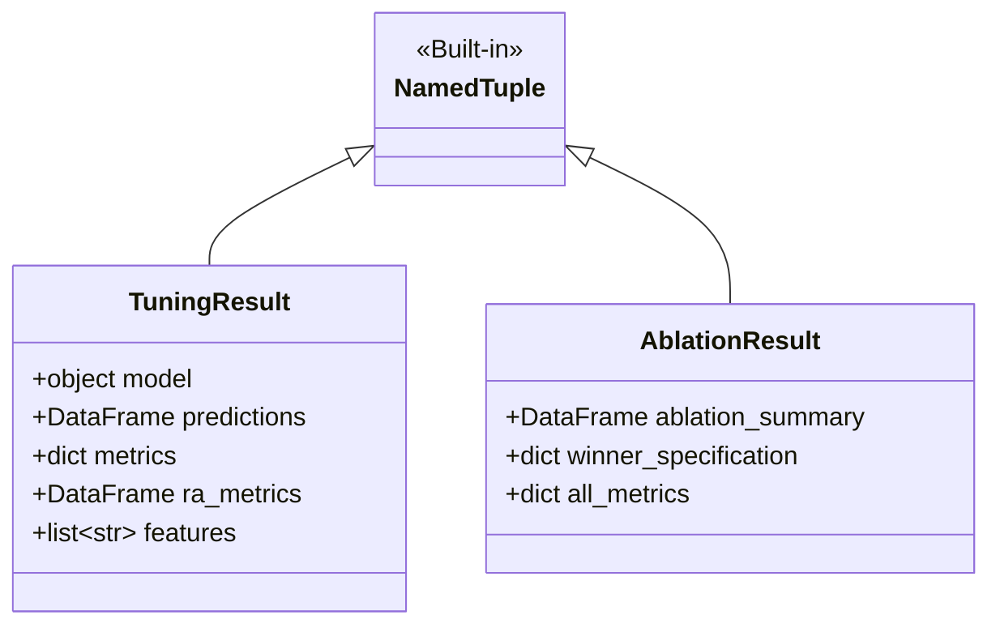

# TDD-04 - Contratos de Interface via NamedTuples

| Campo            | Valor                                                                                                                                                                          |
| ---------------- | ------------------------------------------------------------------------------------------------------------------------------------------------------------------------------ |
| **Tech Lead**    | @roger-quinelato                                                                                                                                                               |
| **Team**         | @roger-quinelato                                                                                                                                                               |
| **RFC Relacionada**| [RFC-04: Contratos de Interface via Dataclasses/NamedTuples](file:///c:/arbodf/DocML/planosImediatos/RFC-04-contratos-interface-dataclasses.md)                             |
| **Status**       | Draft                                                                                                                                                                          |
| **Criado em**    | 2026-05-27                                                                                                                                                                     |
| **Atualizado em**| 2026-05-27                                                                                                                                                                     |

---

## 1. Contexto

Este Documento de Design Técnico (TDD) estabelece a reestruturação dos tipos de retorno das funções críticas do pipeline de modelagem preditiva da dengue no Distrito Federal (DF). 

Atualmente, funções-chave de modelagem e validação, como `executar_ajuste_previsao` em `train_tuning.py` e `executar_estudo_ablacao` em `evaluation.py` (ou `orchestration.py`, conforme TDD-03), retornam tuplas posicionais não tipadas e massivas de até 5 elementos (e.g. `modelo, pred_df, metricas, ra_metricas, features`). A manipulação dessas estruturas com base em posições estáticas de indexação ou desempacotamento de variáveis é frágil e oculta de forma silenciosa o que está sendo descartado por meio de caracteres de sublinhado (`_`). Além disso, impede ferramentas de checagem estática de tipo (como `mypy` e `pyright`) e IDEs de fornecerem autocompletar útil, elevando o risco de bugs em tempo de execução durante refatorações.

Com base na deliberação da RFC-04, a solução adotará **`typing.NamedTuple`** como a tecnologia de encapsulamento contratual. Esta decisão oferece o melhor compromisso de engenharia: adiciona *type safety* estrita no nível de atributo ao mesmo tempo que mantém 100% de retrocompatibilidade com desempacotamentos posicionais existentes, evitando alterações invasivas em cascata nos múltiplos locais de chamada no repositório.

---

## 2. Definição do Problema e Motivação

### Problemas Resolvidos

*   **P-01: Acoplamento Posicional Frágil:**
    Alterações triviais na ordem dos retornos das tuplas ou a inserção de um novo campo quebram imediatamente e silenciosamente todos os chamadores operacionais em tempo de execução.
*   **P-02: Rastreabilidade de Tipo Nula para IDEs e Linters:**
    Ferramentas de análise estática e IDEs não conseguem deduzir a assinatura de tipos interna de retornos como `tuple[Any, Any, Any, Any, Any]`, inviabilizando avisos de tipagem estática nos campos internos.
*   **P-03: Descarte Opaco de Variáveis (`_` como Placeholder):**
    O uso recorrente de desempacotamento parcial como `model, pred_df, metrics, _, _ = executar_ajuste_previsao(...)` torna o código opaco para revisões e auditoria científica (Doutorado), ocultando o tipo e o valor das variáveis descartadas.

### Impacto de Não Agir

*   **Bomba Silenciosa em Refatorações:** Qualquer evolução de features (como inclusão de novas métricas de incerteza ou listas adicionais) exige varredura manual de todo o repositório sob risco de quebras em runtime.
*   **Inviabilidade de Análise Estática:** Impossibilidade de habilitar `mypy` ou `pyright` de forma produtiva nas camadas de modelagem e orquestração.

---

## 3. Escopo

### ✅ Em Escopo

*   **Módulo Central de Contratos:** Criação de `src/dengue_pipeline/shared_kernel/types.py` (ou `modeling/types.py`) para hospedar as definições formais das estruturas de interface de dados.
*   **Encapsulamento de Retorno de Modelagem:** Definição da estrutura `TuningResult` para encapsular o retorno de `executar_ajuste_previsao`.
*   **Encapsulamento de Retorno de Ablação:** Definição da estrutura `AblationResult` para encapsular o retorno de `executar_estudo_ablacao`.
*   **Type Hinting Estrito:** Tipagem completa de todos os campos (incluindo `pd.DataFrame`, `dict[str, float]`, estimadores scikit-learn e listas).
*   **Suporte a Tipagem Estática:** Inclusão do arquivo marcador `py.typed` para sinalizar conformidade com type-checkers.

### ❌ Fora de Escopo

*   Substituição de parâmetros de entrada de funções por dataclasses complexas nesta fase (foco estrito nos retornos de tuplas massivas).
*   Migração de dataframes pandas para modelos de validação de dados em runtime em tempo de execução de schema (como Pydantic ou Pandera) - a validação de tipo é estritamente estática.

---

## 4. Solução Técnica

A solução introduz estruturas formais baseadas na biblioteca padrão Python `typing.NamedTuple`, que estendem a capacidade das tuplas tradicionais através de atributos nomeados sem introduzir nenhuma dependência de terceiros.

### Arquitetura de Contratos



---

### Componentes e Tipagens Detalhadas

Os novos contratos serão hospedados em um arquivo específico para evitar dependências circulares de tipagem:
`src/dengue_pipeline/modeling/types.py`

#### 1. Estrutura `TuningResult`
Representa de forma tipada os resultados obtidos de um ciclo completo de ajuste e previsão:

```python
from typing import NamedTuple, Any, list
import pandas as pd

class TuningResult(NamedTuple):
    """
    Contrato de interface para o resultado de modelagem preditiva e ajuste.
    
    Atributos:
        model: Objeto do estimador ajustado compatível com a API scikit-learn (RandomForest ou XGBoost).
        predictions: DataFrame Pandas contendo predições detalhadas de incidência e casos absolutos.
        metrics: Dicionário contendo métricas de performance agregadas a nível de DF (RMSE, MAE, R2, sMAPE, Cobertura).
        ra_metrics: DataFrame contendo as métricas de performance discriminadas individualmente por RA.
        features: Lista de strings com os nomes das features (matriz de design) utilizadas para treinar o modelo.
    """
    model: Any
    predictions: pd.DataFrame
    metrics: dict[str, float]
    ra_metrics: pd.DataFrame
    features: list[str]
```

#### 2. Estrutura `AblationResult`
Representa a resposta consolidada de um estudo de ablação experimental de features:

```python
class AblationResult(NamedTuple):
    """
    Contrato de interface para os resultados de testes de ablação sistemática.
    
    Atributos:
        ablation_summary: DataFrame de sumário comparando o desempenho de cada configuração.
        winner_specification: Dicionário com a configuração de features e algoritmo vencedor.
        all_metrics: Dicionário detalhado mapeando cada combinação às suas métricas brutas.
    """
    ablation_summary: pd.DataFrame
    winner_specification: dict[str, Any]
    all_metrics: dict[str, dict[str, float]]
```

---

### Assinaturas de API Atualizadas

As assinaturas de funções serão refatoradas para declarar explicitamente os novos tipos nos arquivos `train_tuning.py` e `orchestration.py` (ou `evaluation.py`):

#### 1. Interface de Treino e Ajuste (`train_tuning.py`)
```python
from dengue_pipeline.modeling.types import TuningResult

def executar_ajuste_previsao(
    df: pd.DataFrame,
    config: str,
    nome_modelo: str,
    parametros: dict | None = None,
    ano_teste: int = 2025,
) -> TuningResult:
    # Lógica interna de ajuste do modelo...
    
    return TuningResult(
        model=modelo,
        predictions=pred_df,
        metrics=metricas,
        ra_metrics=ra_metrics,
        features=features
    )
```

#### 2. Interface de Ablação (`orchestration.py` / `evaluation.py`)
```python
from dengue_pipeline.modeling.types import AblationResult

def executar_estudo_ablacao(
    df: pd.DataFrame, 
    run_dir: Path | None = None
) -> AblationResult:
    # Lógica experimental...
    
    return AblationResult(
        ablation_summary=ablation_df,
        winner_specification=winner_dict,
        all_metrics=raw_metrics_dict
    )
```

---

### Preservação do Padrão de Chamada (Garantia de Retrocompatibilidade)

Graças ao uso de `NamedTuple`, chamadores legados do pipeline continuarão a funcionar **sem alteração**, desempacotando o retorno posicionalmente. No entanto, novos desenvolvimentos poderão (e deverão) usar acesso nominal:

```python
# Padrão Legado (Continua funcionando perfeitamente sem quebrar):
model, pred, metrics, _, _ = executar_ajuste_previsao(df, config, "RF")

# Padrão Recomendado Novo (Mais legível, seguro e com auto-complete na IDE):
resultado = executar_ajuste_previsao(df, config, "RF")
rmse = resultado.metrics["rmse_df"]
cobertura = resultado.metrics.get("coverage_score", 0.0)
```

---

## 5. Riscos e Mitigações

| Risco | Impacto | Probabilidade | Mitigação |
| :--- | :--- | :--- | :--- |
| **Instrução de Desempacotamento Incorreta:** Inclusão de um novo elemento na NamedTuple que quebre desempacotamentos posicionais que assumem tamanho exato de 5 elementos. | **Alto** | **Baixo** | Estabelecer o compromisso de nunca adicionar novos campos no meio da estrutura; novos atributos opcionais devem ser inseridos apenas no final da assinatura e ter valores default, ou migrar definitivamente para acesso nominal em refatorações futuras. |
| **Erros de Tipagem Silenciosos em Runtime:** O interpretador Python ignora Type Hints, permitindo que tipos incorretos passem despercebidos sem análise estática. | **Baixo** | **Médio** | Acoplar a checagem de tipos estática `mypy --check-untyped-defs` nas etapas pré-commit ou execução de testes de integração. |
| **Sobrecarga de performance em NamedTuples:** NamedTuples possuírem maior custo de alocação que tuplas tradicionais. | **Nulo** | **Baixo** | Em Python, `NamedTuple` é compilado de forma otimizada com consumo de memória e velocidade virtualmente idênticos aos de uma tupla comum de baixo nível. |

---

## 6. Plano de Implementação

### Cronograma de Atividades

1.  **Fase 1: Implementação dos Tipos (Dia 1)**
    *   Criar o arquivo `src/dengue_pipeline/modeling/types.py`.
    *   Definir as NamedTuples `TuningResult` e `AblationResult` com tipagem explícita completa.
2.  **Fase 2: Adaptação das Funções (Dia 1-2)**
    *   Substituir retornos de tuplas cruas em `executar_ajuste_previsao` pela instância correspondente de `TuningResult`.
    *   Substituir retornos em `executar_estudo_ablacao` por `AblationResult`.
3.  **Fase 3: Auditoria Mypy e Type Hints (Dia 2)**
    *   Ativar `mypy` no diretório de modelagem e corrigir quaisquer discrepâncias de tipos detectadas.
    *   Criar arquivo vazio marcador `py.typed` em `src/dengue_pipeline/py.typed` para informar suporte a type checkers.
4.  **Fase 4: Validação Integrada (Dia 3)**
    *   Executar a suite completa do pipeline para atestar que os desempacotamentos legados em `__main__.py` e visualizadores continuam íntegros e compatíveis.

---

## 7. Estratégia de Testes

### 1. Testes de Retrocompatibilidade (Desempacotamento Posicional)
Garantir que aNamedTuple funciona idêntica a uma tupla comum:

```python
def test_tuning_result_unpacking():
    """Garante que TuningResult permite desempacotamento posicional legado."""
    result = TuningResult(model="estimador", predictions=None, metrics={}, ra_metrics=None, features=[])
    
    # Executa desempacotamento
    model, predictions, metrics, ra_metrics, features = result
    
    assert model == "estimador"
    assert len(features) == 0
```

### 2. Testes de Acesso Nominal
Garantir que atributos nomeados funcionam de forma segura:

```python
def test_tuning_result_attributes():
    """Garante que TuningResult expõe atributos nomeados corretos."""
    result = TuningResult(model="estimador", predictions=None, metrics={"rmse": 0.5}, ra_metrics=None, features=["lags"])
    
    assert result.model == "estimador"
    assert result.metrics["rmse"] == 0.5
    assert result.features == ["lags"]
```

### 3. Testes de Imutabilidade Estrita
Verificar que a NamedTuple impede modificação pós-alocação:

```python
import pytest

def test_tuning_result_immutability():
    """Garante que TuningResult é imutável após a criação."""
    result = TuningResult(model="RF", predictions=None, metrics={}, ra_metrics=None, features=[])
    
    with pytest.raises(AttributeError):
        result.model = "XGB"  # Não deve permitir atribuição
```

---

## 8. Monitoramento e Observabilidade

*   **Diagnóstico de Tipos:** A integração do `py.typed` permite que o VS Code, PyCharm e ferramentas de CLI reportem inconsistências de tipo no exato instante da escrita do código pelo desenvolvedor, evitando que erros simples de digitação de chaves cheguem à produção.

---

## 9. Plano de Rollback

*   **Ponto de Restauração Git:** Criação de branch dedicada de tipagem (`feature/type-contracts`). Caso ocorra incompatibilidade com alguma biblioteca de processamento secundária, a reversão consiste no descarte da branch.
*   **Fallback Fácil:** Como a NamedTuple herda da tupla clássica de forma transparente, se houver necessidade emergencial de reverter as tipagens, basta substituir as instanciações das NamedTuples no final das funções retornando as tuplas normais originais, sem necessidade de reescrever as lógicas de chamada externas.

---

## 10. Alternativas Consideradas

*   **Alternativa 1: `@dataclass(frozen=True)` (Opção 1 da RFC):**
    *   *Vantagens:* Permite definição de comportamentos e métodos internos ricos; imutabilidade semântica explícita.
    *   *Desvantagens:* **Quebra severa de retrocompatibilidade** em todos os chamadores posicionais existentes, forçando uma refatoração imediata e onerosa de 100% dos locais de desempacotamento no código.
    *   *Decisão:* Rejeitada temporariamente como passo inicial em favor de `NamedTuple`, mas mantida no horizonte tecnológico para versões futuras quando todos os chamadores forem migrados para acesso puramente nominal.
*   **Alternativa 2: `TypedDict`:**
    *   *Vantagens:* Compatível com a sintaxe de dicionário Python comum.
    *   *Desvantagens:* Sintaxe de acesso de chave por string (`result["predictions"]`) mais propensa a erros de digitação e sem autocompletar na IDE tão fluida quanto atributos pontilhados (`.predictions`).

---

## 11. Glossário

*   **Type Hinting:** Anotação sintática opcional em Python que declara os tipos pretendidos de variáveis, parâmetros e retornos para análise estática.
*   **Análise Estática (Type-checking):** Processo de validação da coerência lógica de tipos de dados sem executar fisicamente o código (e.g. usando mypy).
*   **NamedTuple:** Estrutura que estende a tupla estendendo acesso a campos por chave de atributo em adição ao acesso posicional clássico.
*   **py.typed:** Arquivo marcador definido na PEP 561 que indica aos checadores de tipo que o pacote suporta e fornece type hints úteis.
