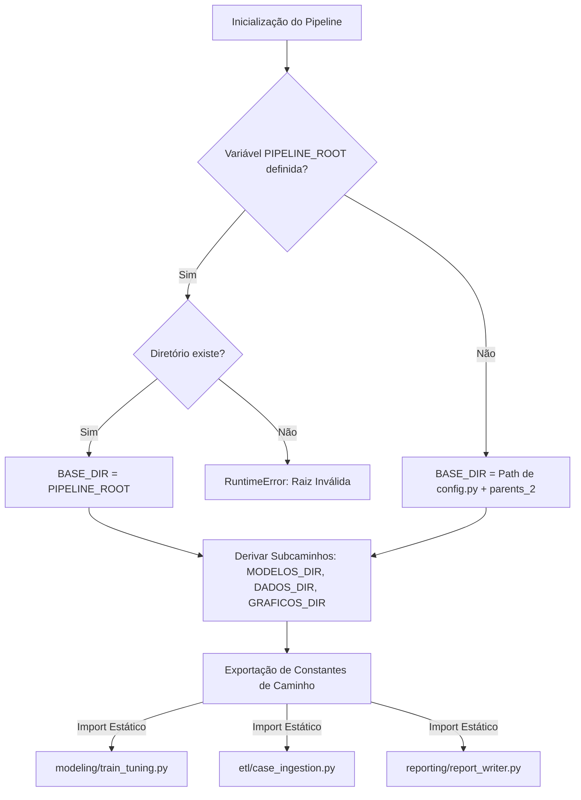

# TDD-05 - Gerenciamento de Configuração de Caminhos

| Campo            | Valor                                                                                                                                                                          |
| ---------------- | ------------------------------------------------------------------------------------------------------------------------------------------------------------------------------ |
| **Tech Lead**    | @roger-quinelato                                                                                                                                                               |
| **Team**         | @roger-quinelato                                                                                                                                                               |
| **RFC Relacionada**| [RFC-05: Gerenciamento de Configuração de Caminhos](file:///c:/arbodf/DocML/planosImediatos/RFC-05-gerenciamento-configuracao-caminhos.md)                                     |
| **Status**       | Draft                                                                                                                                                                          |
| **Criado em**    | 2026-05-27                                                                                                                                                                     |
| **Atualizado em**| 2026-05-27                                                                                                                                                                     |

---

## 1. Contexto

Este Documento de Design Técnico (TDD) estabelece a padronização e o gerenciamento de caminhos de arquivos (*path routing*) no repositório de modelagem da dengue no Distrito Federal (DF).

Atualmente, pelo menos 9 módulos operacionais distintos do pipeline computam a raiz do projeto de forma descentralizada e redundante através da âncora posicional do sistema de arquivos:
```python
BASE_DIR = Path(__file__).resolve().parents[3]
```

Essa abordagem baseada no número mágico `.parents[3]` (ou `.parents[2]` no caso de `__main__.py`) assume estritamente que cada arquivo reside a uma distância fixa e imutável de subníveis em relação à raiz do projeto. Isso torna a base de código extremamente frágil: mover qualquer script de análise, ETL ou relatório para outro subdiretório para melhor organização (como proposto nas etapas de desacoplamento da RFC-03) quebra silenciosamente toda a lógica de escrita e leitura de CSVs, gráficos, JSONs e modelos serializados. 

A solução proposta implementa um **Módulo de Configuração Centralizado (`config.py`)**, unificando a resolução de diretórios físicos do projeto sob o princípio DRY (*Don't Repeat Yourself*), oferecendo suporte à injeção via variável de ambiente para execuções robustas em containers (Docker) ou servidores de CI/CD, e forçando falhas explícitas (*Fail-Fast*) em tempo de inicialização caso diretórios críticos estejam corrompidos ou inacessíveis.

---

## 2. Definição do Problema e Motivação

### Problemas Resolvidos

*   **P-01: Fragilidade Estrutural do Número Mágico `parents[N]`:**
    Mover qualquer arquivo do pacote `modeling/`, `etl/` ou `reporting/` altera sua profundidade de pastas, quebrando caminhos hardcoded de persistência silenciosamente (gerando e gravando arquivos em caminhos fantasmas indesejados).
*   **P-02: Violação Sistemática do Princípio DRY:**
    A mesma linha de lógica de ancoragem é replicada em 9 arquivos independentes: `case_ingestion.py`, `weather_ingestion.py`, `conformal_prediction.py`, `feature_engineering.py`, `train_tuning.py`, `orchestration.py`, `report_writer.py`, `ra_registry.py` e `scaffold.py`.
*   **P-03: Impossibilidade de Injeção de Caminhos Dinâmicos:**
    Dificuldade para definir raizes de dados alternativas em ambientes de testes automatizados ou infraestruturas isoladas, exigindo técnicas perigosas de *monkey-patching* em variáveis internas durante as execuções do pipeline.

### Impacto de Não Agir

*   **Bloqueio de Reorganização Arquitetural:** Impossibilidade de realizar refatorações saudáveis de diretórios sem disparar uma varredura manual exaustiva de caminhos quebrados no repositório.
*   **Falhas Silenciosas em Produção:** Risco de escrita de relatórios e cache fora das pastas dedicadas, poluindo a máquina local ou gerando erros insolúveis de permissão de gravação sem mensagens amigáveis.

---

## 3. Escopo

### ✅ Em Escopo

*   **Módulo Central de Configuração:** Criação de `src/dengue_pipeline/config.py` atuando como a única fonte de verdade de caminhos.
*   **Resolução Dinâmica com Fallback:** Suporte à variável de ambiente `PIPELINE_ROOT` para injeção de caminhos externos, mantendo a autodetecção baseada em âncora relativa como fallback padrão para execuções locais sem configuração prévia.
*   **Substituição Global:** Remoção de todas as 10 ocorrências duplicadas de `.parents[N]` no repositório.
*   **Validação Fail-Fast:** Inserção de rotinas automáticas de checagem física de existência de diretórios essenciais.

### ❌ Fora de Escopo

*   Migração de caminhos e infraestrutura de ingestão de bancos de dados externos complexos (o escopo é restrito à árvore do sistema de arquivos local do projeto).
*   Alterações na especificação dos formatos físicos dos dados (como migrar de Parquet para bancos relaciais locais).

---

## 4. Solução Técnica

A arquitetura de resolução centraliza todos os caminhos derivados e variáveis globais em um local único.

### Fluxo de Resolução de Caminhos

A lógica abaixo detalha como a raiz do projeto é deduzida e compartilhada de forma segura entre todos os subsistemas do projeto:



---

### Especificação de Variáveis e Componentes

#### 1. Novo Módulo: `src/dengue_pipeline/config.py`
Este arquivo conterá a lógica encapsulada de ancoragem e exportará as constantes como objetos `pathlib.Path`:

```python
import os
import sys
from pathlib import Path

def _resolve_base_dir() -> Path:
    """
    Deduz a raiz física do pipeline epidemiológico de forma fail-fast.
    
    Verifica primeiro a presença da variável de ambiente 'PIPELINE_ROOT'.
    Caso ausente, utiliza a localização física do arquivo 'config.py' 
    (esperado na pasta 'src/dengue_pipeline/') para computar 'parents[2]'.
    """
    env_root = os.getenv("PIPELINE_ROOT")
    if env_root:
        base = Path(env_root).resolve()
        if not base.exists():
            print(f"[ERRO ARQUITETURAL] PIPELINE_ROOT informada em variável de ambiente não existe: '{env_root}'", file=sys.stderr)
            raise RuntimeError(f"PIPELINE_ROOT informada não existe: '{env_root}'")
        return base
        
    # config.py reside em src/dengue_pipeline/config.py (2 níveis abaixo da raiz)
    return Path(__file__).resolve().parents[2]

# --- 1. Raiz do Projeto ---
BASE_DIR = _resolve_base_dir()

# --- 2. Diretórios Físicos Derivados ---
DADOS_PROCESSADOS_DIR = BASE_DIR / "dados_processados"
MODELOS_DIR           = BASE_DIR / "resultados_modelagem"
GRAFICOS_DIR          = BASE_DIR / "resultados_graficos"
NOTEBOOK_DIR          = BASE_DIR / ".notebook"
SCRIPTS_DIR           = BASE_DIR / "scripts"

# --- 3. Arquivos de Metadados e Modelos Críticos ---
CAMINHO_DATASET_PARQUET     = DADOS_PROCESSADOS_DIR / "dataset_processado.parquet"
CONFORMAL_CALIBRATION_JSON  = MODELOS_DIR / "conformal_calibration.json"
ROLLING_RESULTS_CSV         = MODELOS_DIR / "rolling_validation_resultados.csv"
ABLATION_CSV                = MODELOS_DIR / "resultados_ablacao_nowcasting.csv"
ABLATION_RA_CSV             = MODELOS_DIR / "resultados_ablation_por_ra.csv"
ABLATION_PRED_CSV           = MODELOS_DIR / "predicoes_ablation.csv"
WINNER_JSON                 = MODELOS_DIR / "campeao_ablacao_nowcasting.json"
```

---

### Mapeamento de Substituições de Caminhos nos Módulos

Após a criação do `config.py`, todos os módulos contendo código posicional hardcoded serão refatorados conforme a tabela abaixo:

| Módulo Original | Caminho Atual Hardcoded | Nova Referência Importada |
| :--- | :--- | :--- |
| `etl/case_ingestion.py` | `Path(__file__).resolve().parents[3]` | `from dengue_pipeline.config import BASE_DIR` |
| `etl/weather_ingestion.py` | `Path(__file__).resolve().parents[3]` | `from dengue_pipeline.config import BASE_DIR` |
| `modeling/feature_engineering.py` | `Path(__file__).resolve().parents[3]` <br> `BASE_DIR / "dados_processados" / "dataset.parquet"` | `from dengue_pipeline.config import CAMINHO_DATASET_PARQUET` |
| `modeling/train_tuning.py` | `Path(__file__).resolve().parents[3]` <br> `BASE_DIR / "resultados_modelagem"` | `from dengue_pipeline.config import BASE_DIR, MODELOS_DIR, ROLLING_RESULTS_CSV` |
| `modeling/conformal_prediction.py` | `Path(__file__).resolve().parents[3]` <br> `BASE_DIR / "resultados_modelagem" / "conformal_calibration.json"` | `from dengue_pipeline.config import CONFORMAL_CALIBRATION_JSON` |
| `modeling/evaluation.py` | `Path(__file__).resolve().parents[3]` <br> `ABLATION_CSV = ...` | `from dengue_pipeline.config import ABLATION_CSV, ABLATION_RA_CSV, ABLATION_PRED_CSV, WINNER_JSON` |
| `modeling/orchestration.py` | `Path(__file__).resolve().parents[3]` | `from dengue_pipeline.config import BASE_DIR` |
| `reporting/report_writer.py` | `Path(__file__).resolve().parents[3]` | `from dengue_pipeline.config import BASE_DIR, GRAFICOS_DIR` |
| `shared_kernel/ra_registry.py` | `Path(__file__).resolve().parents[3]` | `from dengue_pipeline.config import BASE_DIR` |
| `utils/scaffold.py` | `Path(__file__).resolve().parents[3]` | `from dengue_pipeline.config import BASE_DIR` |
| `__main__.py` | `Path(__file__).resolve().parents[2]` | `from dengue_pipeline.config import BASE_DIR` |

---

## 5. Riscos e Mitigações

| Risco | Impacto | Probabilidade | Mitigação |
| :--- | :--- | :--- | :--- |
| **Inexistência de Pastas Físicas:** Tentar gravar um arquivo em um subdiretório derivado (como `resultados_modelagem`) antes que a pasta raiz tenha sido criada no sistema de arquivos local. | **Alto** | **Médio** | Adicionar checagem ativa com criação automática de subpastas (`mkdir(exist_ok=True)`) na inicialização do `__main__.py` ou na própria inicialização de `config.py`. |
| **Recursão e Dependência Circular de Imports:** O arquivo `config.py` tentar importar algo de `shared_kernel` ou `utils` que, por sua vez, tenta importar de `config.py`. | **Médio** | **Baixo** | Manter `config.py` inteiramente independente e isolado; ele utilizará apenas bibliotecas nativas do Python (`os`, `sys`, `pathlib`) e nunca importará nenhum módulo interno do projeto. |
| **Quebra de Scripts Externos Ad-Hoc:** Scripts utilitários de análise manual executados fora do namespace do pacote (`python scripts/analise.py`) falharem ao tentar localizar a raiz do projeto. | **Médio** | **Médio** | Instruir a definição obrigatória da variável de ambiente `PIPELINE_ROOT` em scripts avulsos ou fornecer tratamento de exceção amigável no `config.py`. |

---

## 6. Plano de Implementação

### Cronograma de Atividades

1.  **Fase 1: Implementação do Config (Dia 1)**
    *   Criar o arquivo `src/dengue_pipeline/config.py`.
    *   Codificar a rotina `_resolve_base_dir` com suporte a `PIPELINE_ROOT` e fallback relativo.
2.  **Fase 2: Refatoração Gradual dos Módulos (Dia 1-2)**
    *   Refatorar os módulos de Ingestão (`case_ingestion.py`, `weather_ingestion.py`).
    *   Refatorar módulos de Modelagem (`feature_engineering.py`, `conformal_prediction.py`, `train_tuning.py`, `evaluation.py`).
    *   Refatorar módulos de Visualização e Utilidades (`report_writer.py`, `__main__.py`).
3.  **Fase 3: Documentação e Scaffold (Dia 3)**
    *   Adicionar instruções no `README.md` sobre o uso e os benefícios de `PIPELINE_ROOT`.
    *   Criar o arquivo `.env.example` registrando o placeholder da variável.
4.  **Fase 4: Validação Total (Dia 3)**
    *   Executar o pipeline completo e atestar que a persistência física ocorreu de forma correta e sem desvios de arquivos.

---

## 7. Estratégia de Testes

### 1. Testes Unitários de Autodetecção Padrão (Sem Variável de Ambiente)
Garantir que a detecção padrão baseada em `__file__` deduz a pasta raiz correta do repositório local:

```python
import os
from pathlib import Path
from dengue_pipeline.config import BASE_DIR

def test_base_dir_default_resolution():
    """Garante que a raiz autodetectada possui a subpasta 'src'."""
    assert BASE_DIR.is_dir()
    assert (BASE_DIR / "src").exists()
    assert (BASE_DIR / "src" / "dengue_pipeline").exists()
```

### 2. Testes de Injeção via Variável de Ambiente (`PIPELINE_ROOT`)
Garantir que o pipeline aceita e roteia os caminhos físicos a partir de uma pasta virtual ou temporária em tempo de testes:

```python
import os
import importlib
import pytest
from pathlib import Path

def test_pipeline_root_injection(tmp_path):
    """Garante que o BASE_DIR obedece estritamente à variável PIPELINE_ROOT se definida."""
    # Configura env
    os.environ["PIPELINE_ROOT"] = str(tmp_path.resolve())
    
    # Recarrega o módulo para ler a nova variável de ambiente
    import dengue_pipeline.config
    importlib.reload(dengue_pipeline.config)
    
    # Assert
    assert dengue_pipeline.config.BASE_DIR == tmp_path.resolve()
    
    # Limpa env
    del os.environ["PIPELINE_ROOT"]
```

### 3. Teste Fail-Fast para Caminhos Inexistentes
Validar que o pipeline falha de forma limpa e informativa se o caminho injetado for corrompido:

```python
def test_pipeline_root_invalid_fails():
    """Garante que uma exceção explícita é lançada se a pasta informada via env não existir."""
    os.environ["PIPELINE_ROOT"] = "/caminho/completamente/fantasma/inexistente"
    
    import dengue_pipeline.config
    
    with pytest.raises(RuntimeError) as exc_info:
        importlib.reload(dengue_pipeline.config)
        
    assert "não existe" in str(exc_info.value)
    
    # Limpa env
    del os.environ["PIPELINE_ROOT"]
```

---

## 8. Monitoramento e Observabilidade

*   **Log de Inicialização:** Durante a carga do `__main__.py`, o pipeline logará no console a raiz física adotada:
    ```
    >>> [CONFIG] Raiz do Projeto Adotada: c:\arbodf\DocML (Autodetectada)
    ```
    Ou:
    ```
    >>> [CONFIG] Raiz do Projeto Adotada: /data/dengue_root (Injetada via PIPELINE_ROOT)
    ```
*   **Validação de Estrutura:** Caso uma das pastas necessárias (como `dados_processados` ou `resultados_modelagem`) não exista na raiz e não possa ser criada por erros de permissão, o sistema abortará imediatamente com código de erro limpo, evitando processamento em lote inútil ou gravações corrompidas.

---

## 9. Plano de Rollback

*   **Ponto de Restauração Git:** Todo o desenvolvimento será feito no branch isolado `feature/centralized-paths`. Em caso de problemas não previstos de caminhos, o descarte da branch garante a integridade imediata do codebase legado.
*   **Fallback Seguro em Config:** Como a autodetecção baseada em fallback simula exatamente o caminho relativo original, as execuções dos desenvolvedores locais continuarão a funcionar exatamente da mesma forma como funcionavam antes, mitigando riscos práticos na transição.

---

## 10. Alternativas Consideradas

*   **Alternativa 1: get_base_dir() utilitário em `shared_kernel` (Opção 2 do RFC):**
    *   *Racional:* Criar uma função utilitária `shared_kernel.paths.get_base_dir()` e importá-la nos módulos operacionais.
    *   *Decisão:* Rejeitada. Embora evite a criação de um arquivo `config.py`, mistura responsabilidades de configurações de ambiente e paths físicos com o `shared_kernel` (que lida com domínio epidemiológico, RAs, população), gerando má separação de conceitos.
*   **Alternativa 2: Manter caminhos estáticos em variáveis locais:**
    *   *Racional:* Continuar dependendo de caminhos ad-hoc em cada script.
    *   *Decisão:* Fortemente rejeitada por quebrar DRY e inviabilizar qualquer reorganização de arquivos no namespace sem quebra silenciosa generalizada.

---

## 11. Glossário

*   **DRY (Don't Repeat Yourself):** Princípio de engenharia de software focado em reduzir a duplicação de padrões de lógica ou informação em favor de abstrações únicas.
*   **Fail-Fast:** Filosofia de design que preconiza que um sistema deve abortar sua execução imediatamente e de forma barulhenta ao detectar qualquer erro de premissa crítica ou configuração inválida.
*   **Path Routing:** Lógica de mapeamento e resolução física de caminhos de arquivos e diretórios dentro do namespace de um projeto de software.
*   **Monkey-Patching:** Técnica dinâmica que altera o comportamento ou valores de atributos de um módulo em tempo de execução de forma temporária.
