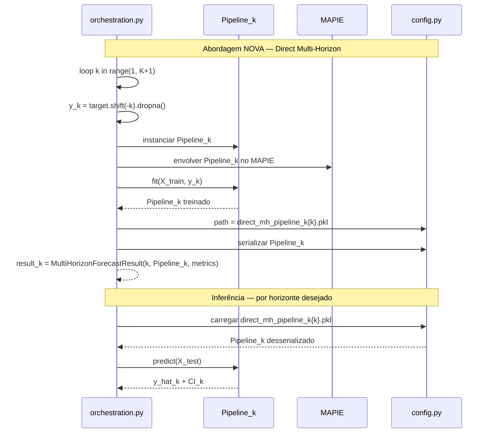

# TDD-09: Estratégia de Forecast Multi-Step e Integração Arquitetural

| Campo             | Valor                                                                 |
|-------------------|-----------------------------------------------------------------------|
| **Tech Lead**     | @roger-quinelato                                                      |
| **Time**          | @roger-quinelato                                                      |
| **RFC de Origem** | [RFC-09](./RFC-09-estrategia-forecast-multistep.md)                   |
| **Épico/Ticket**  | —                                                                     |
| **Status**        | Draft                                                                 |
| **Criado em**     | 2026-05-29                                                            |
| **Atualizado**    | 2026-05-29                                                            |
| **RFCs Relacionadas** | RFC-01 (Conformal Prediction), RFC-02 (sklearn.Pipeline), RFC-03 (orchestration.py), RFC-04 (NamedTuple contracts), RFC-05 (config.py) |

---

## Contexto

O pipeline de forecasting de dengue (`dengue_pipeline`) realiza previsões de múltiplas semanas para suporte à vigilância epidemiológica. A abordagem atual — implementada em `train_tuning.py` via `executar_validacao_temporal` — usa **previsão autoregressiva recursiva**: a predição do passo `t+1` torna-se a entrada do passo `t+2`, e assim por diante.

**Background:**
Este design é tecnicamente incompatível com as reformas arquiteturais já aprovadas nas RFCs recentes. As RFCs 01–05 estabeleceram uma nova arquitetura baseada em `sklearn.Pipeline` encapsulado, contratos de interface via `NamedTuple`, gerenciamento centralizado de artefatos via `config.py`, e desacoplamento do fluxo via `orchestration.py`. A previsão recursiva "vaza" por fora desses encapsulamentos e impede que a biblioteca MAPIE (RFC-01/02) gere intervalos de confiança multi-horizon calibrados corretamente.

**Domínio:**
Forecasting epidemiológico multi-horizon. O problema central é o **Exposure Bias**: o modelo é treinado com séries históricas reais, mas na inferência alimenta seus próprios erros como entradas, causando degradação exponencial da qualidade da previsão conforme o horizonte aumenta.

**Stakeholders:**
- Pesquisadores e epidemiologistas que consomem previsões multi-semana
- Pipeline de CI/CD que serializa e versiona os artefatos de modelo
- RFC-01 (MAPIE): depende de pipelines estáticos para calibração correta de incertezas
- RFC-04 e RFC-05: definem os contratos de artefatos que esta RFC deve respeitar

---

## Definição do Problema e Motivação

### Problemas que Estamos Resolvendo

- **Problema 1 — Exposure Bias na Previsão Recursiva:**
  O modelo é treinado com lags de valores reais (`y_real_t-1`, `y_real_t-2`, …), mas durante a inferência multi-step, os lags passam a ser predições do próprio modelo. Erros do passo anterior se acumulam exponencialmente nos passos seguintes. Em dinâmicas epidemiológicas com padrões não-lineares (surtos, vales sazonais), este viés se amplifica com rapidez.
  - **Impacto:** Previsões de semanas 4–8 são sistematicamente degradadas sem nenhuma forma de detecção ou correção no design atual.

- **Problema 2 — Incompatibilidade Arquitetural com sklearn.Pipeline e MAPIE:**
  A previsão recursiva é implementada fora do `sklearn.Pipeline`, quebrando o encapsulamento definido na RFC-02. A biblioteca MAPIE (RFC-01), que precisa envolver o estimador final para gerar intervalos conformal, não consegue calibrar intervalos multi-horizon corretamente neste cenário, pois o horizonte é construído em runtime fora do pipeline.
  - **Impacto:** Os intervalos de confiança das semanas futuras não têm garantias de cobertura calibrada; o esforço de reforma das RFCs 01–02 é parcialmente perdido.

- **Problema 3 — Falta de Contratos de Artefatos para Modelos Multi-Horizon:**
  Não há tipagem formal para o resultado de um forecast multi-horizon, nem mapeamento em `config.py` para os artefatos por horizonte `k`. Os modelos são serializados de forma ad-hoc, dificultando rastreabilidade e reprodutibilidade.
  - **Impacto:** Violação dos contratos RFC-04 e RFC-05; dificuldade de versionar, comparar e carregar modelos por horizonte.

### Por que Agora?

- A reforma arquitetural das RFCs 01–05 está aprovada e em implementação; postergar este alinhamento cria dívida técnica crescente
- O RFC-09 já está com **status APPROVED** — a decisão foi tomada; este TDD documenta como implementá-la
- A estratégia Direct Multi-Horizon é pré-requisito para que os intervalos de confiança do RFC-01 sejam válidos em horizontes > 1 semana

### Impacto de Não Agir

- **Científico:** Previsões de horizonte longo publicadas com viés sistemático não detectado
- **Técnico:** A reforma arquitetural (RFCs 01–05) ficará incompleta; MAPIE não calibrará intervalos multi-horizon corretamente
- **Operacional:** Impossibilidade de rastrear e versionar modelos por horizonte de forma padronizada

---

## Escopo

### ✅ Em Escopo (V1 — MVP)

- Substituir a previsão recursiva por **Direct Multi-Horizon Forecasting**: treinar um `sklearn.Pipeline` independente para cada horizonte `k`
- Implementar o `NamedTuple` `MultiHorizonForecastResult` como contrato formal de saída, seguindo RFC-04
- Atualizar `orchestration.py` para iterar sobre os horizontes `k`, instanciando e treinando um pipeline isolado por horizonte
- Mapear em `config.py` os caminhos de artefatos por horizonte (`direct_mh_pipeline_k{k}.pkl`), seguindo RFC-05
- Cada pipeline individual permanece compatível com MAPIE para geração de intervalos de confiança por horizonte
- Substituir `executar_validacao_temporal` na parte que faz previsão recursiva multi-step

### ❌ Fora de Escopo (V1)

- Paralelização dos treinamentos via `joblib` — identificado como follow-up; V1 usa iteração sequencial
- Estratégia Multi-Output Regression (`MultiOutputRegressor`) — descartada; incompatível com MAPIE
- Horizontes > 8 semanas — o design é válido para ≤ 8 semanas; horizonte maior exige reavaliação
- Otimização de hiperparâmetros por horizonte de forma independente — cada pipeline usa a mesma grade de HPs em V1
- Interface de comparação entre modelos por horizonte — funcionalidade de avaliação separada

### 🔮 Considerações Futuras (V2+)

- Paralelização com `joblib` para treinamento simultâneo dos `K` pipelines (follow-up explícito do RFC-09)
- Otimização de hiperparâmetros independente por horizonte `k` se os horizontes apresentarem comportamentos muito distintos
- Horizonte > 8 semanas caso o projeto evolua para previsões de longo prazo

---

## Solução Técnica

### Visão Geral da Arquitetura

A solução substitui a inferência recursiva (1 modelo, múltiplas chamadas) por **treinamento direto** (K modelos, 1 chamada por modelo, 1 chamada de inferência por horizonte). Para cada horizonte `k ∈ {1, 2, …, K}`, um `sklearn.Pipeline` completo e isolado é treinado usando como target `y_{t+k}` — o valor real da semana `k` à frente. Cada pipeline contém seu próprio pré-processador e o estimador envolvido pelo MAPIE.

**Componentes Principais:**

- `orchestration.py` — orquestrador central; responsável por iterar sobre `k`, construir os targets deslocados, treinar cada pipeline e coletar resultados no novo `NamedTuple`
- `train_tuning.py` — módulo de treinamento; função `executar_validacao_temporal` terá a lógica recursiva substituída por chamadas únicas por horizonte
- `config.py` — gerenciamento de caminhos de artefatos; adição do padrão `direct_mh_pipeline_k{k}.pkl` por horizonte
- `MultiHorizonForecastResult` — novo `NamedTuple` que encapsula pipeline, métricas e horizonte de cada modelo treinado

### Diagrama de Fluxo

```mermaid
flowchart TD
    A[orchestration.py\nInicia loop k = 1..K] --> B[Construir target deslocado\ny_shifted_k = y.shift_neg_k]
    B --> C[Instanciar sklearn.Pipeline\nPreprocessor + MAPIE Regressor]
    C --> D[Treinar Pipeline_k\ncom validação temporal]
    D --> E[MultiHorizonForecastResult\nhorizon=k, pipeline=Pipeline_k, metrics=dict]
    E --> F[Serializar artefato\nconfig.py → models/direct_mh_pipeline_k{k}.pkl]
    F --> G{k < K?}
    G -- Sim --> B
    G -- Não --> H[Lista de K MultiHorizonForecastResult\nretornada ao orquestrador]
    H --> I[Inferência: carregar Pipeline_k\npor horizonte desejado]
    I --> J[Predição y_hat_t+k\n+ intervalo CI_k via MAPIE]
```

### Diagrama de Sequência — Treinamento vs. Inferência Atual (Recursiva) vs. Nova (Direta)



### Contrato de Dados — `MultiHorizonForecastResult`

```
MultiHorizonForecastResult (NamedTuple)
├── horizon: int          # Horizonte k (1 = próxima semana, 2 = duas semanas, etc.)
├── pipeline: Pipeline    # sklearn.Pipeline completo (preprocessor + MAPIE regressor)
└── metrics: Dict[str, float]  # Métricas de avaliação deste horizonte (RMSE, MAE, coverage, WIS, etc.)
```

> Definido em conformidade com RFC-04 (contratos de interface via NamedTuple).

### Convenção de Artefatos — `config.py`

| Artefato | Padrão de Caminho | Descrição |
|----------|-------------------|-----------|
| Modelo por horizonte | `PIPELINE_ROOT / "models" / "direct_mh_pipeline_k{k}.pkl"` | Pipeline serializado para o horizonte `k` |
| Métricas por horizonte | `PIPELINE_ROOT / "results" / "metrics_horizon_k{k}.json"` | Métricas de avaliação por horizonte |

> Padrão de nomenclatura gerenciado centralmente em `config.py`, seguindo RFC-05.

### Construção do Target por Horizonte

Para cada horizonte `k`, o target é construído deslocando a série temporal `k` passos à frente:

| Horizonte `k` | Target utilizado no treinamento | Semântica |
|---------------|---------------------------------|-----------|
| 1 | `y_{t+1}` (shift de -1) | Previsão para a próxima semana |
| 2 | `y_{t+2}` (shift de -2) | Previsão para daqui a 2 semanas |
| K | `y_{t+K}` (shift de -K) | Previsão para daqui a K semanas |

Os features `X` usados em cada treino são **sempre os valores reais observados até o tempo `t`** — sem alimentar predições anteriores. Isso elimina o exposure bias.

### Estratégia de Validação Temporal

Cada Pipeline_k é avaliado com **validação temporal walkforward**:
- Treinar com observações até `t_fold`
- Predizer `y_{t_fold + k}` (o valor real `k` semanas à frente)
- Avançar o fold e repetir
- Agregar métricas por horizonte ao final

Esta estratégia é executada dentro de `executar_validacao_temporal` (refatorada), sem alterar o protocolo de validação — apenas o target muda por horizonte.

---

## Riscos

| Risco | Impacto | Probabilidade | Mitigação |
|-------|---------|---------------|-----------|
| Custo de treinamento multiplicado por K | Médio | Alto | Início com K=4 (4 semanas); medir tempo por fold; habilitar `joblib` em V2 se necessário |
| Pipeline mais antigo (horizonte menor) desatualizado enquanto o de horizonte maior é retreinado | Médio | Médio | Retreinar todos os K pipelines juntos em cada ciclo de treinamento; orquestrador garante consistência |
| Desalinhamento de índices ao construir `y_{t+k}` (shift negativo + dropna) | Alto | Médio | Testes unitários explícitos de alinhamento X/y por horizonte; validar que `len(X) == len(y_k)` após shift |
| MAPIE com Pipeline_k de horizonte longo: poucos dados de calibração | Médio | Médio | Verificar tamanho mínimo do conjunto de calibração por horizonte; alertar se < threshold |
| Artefatos `k` antigos em disco com nomes conflitantes após refatoração | Baixo | Médio | Convenção de nomenclatura clara em `config.py`; limpeza de artefatos legados via script de migração |
| `MultiHorizonForecastResult` incompatível com código que consome `PredictionResult` existente | Alto | Baixo | Auditar todos os consumidores de `PredictionResult` antes da migração; adaptar ou criar adaptador |

---

## Plano de Implementação

| Fase | Tarefa | Descrição | Responsável | Status | Estimativa |
|------|--------|-----------|-------------|--------|------------|
| **Fase 1 — Contrato** | Definir `MultiHorizonForecastResult` | Criar `NamedTuple` com campos `horizon`, `pipeline`, `metrics` em módulo de tipos | @roger | TODO | 30min |
| | Atualizar `config.py` | Adicionar convenção de caminho `direct_mh_pipeline_k{k}.pkl` e `metrics_horizon_k{k}.json` | @roger | TODO | 30min |
| **Fase 2 — Orquestrador** | Refatorar `orchestration.py` | Implementar loop `for k in range(1, K+1)`: construir target, instanciar pipeline, treinar, coletar resultado | @roger | TODO | 2h |
| | Construção de target deslocado | Lógica de `y.shift(-k).dropna()` com validação de alinhamento X/y | @roger | TODO | 30min |
| **Fase 3 — Treinamento** | Refatorar `executar_validacao_temporal` | Remover lógica recursiva multi-step; adaptar para receber `target_k` como parâmetro | @roger | TODO | 1.5h |
| | Integração com MAPIE por horizonte | Garantir que cada Pipeline_k tem MAPIE configurado para gerar CI por horizonte | @roger | TODO | 1h |
| **Fase 4 — Persistência** | Serialização por horizonte | Implementar serialização/deserialização usando paths de `config.py` | @roger | TODO | 30min |
| **Fase 5 — Testes** | Testes unitários | Alinhamento X/y por horizonte; contrato `MultiHorizonForecastResult`; caminhos de artefato | @roger | TODO | 1.5h |
| | Teste de integração | Rodar pipeline completo para K=2; verificar que artefatos são gerados; verificar CI por horizonte | @roger | TODO | 1h |
| **Fase 6 — Validação** | Medir custo de treinamento | Comparar tempo de treinamento K=4 vs. abordagem atual; documentar benchmark | @roger | TODO | 1h |
| | Limpeza de artefatos legados | Remover arquivos de modelo gerados pela abordagem recursiva anterior | @roger | TODO | 30min |

**Estimativa Total:** ~11–12 horas  
**Sequência obrigatória:** Fase 1 → Fase 2 → Fase 3 → Fase 4 → Fase 5 → Fase 6

---

## Estratégia de Testes

| Tipo de Teste | Escopo | Abordagem |
|---------------|--------|-----------|
| **Unitário** | Construção de target por horizonte; `MultiHorizonForecastResult`; paths de config | DataFrames sintéticos; assert de alinhamento X/y; assert de tipagem do NamedTuple |
| **Integração** | Loop do orquestrador com K=2 horizontes | Pipeline completo treinado; 2 arquivos `.pkl` gerados nos paths corretos; métricas retornadas |
| **Regressão** | Métricas do horizonte k=1 vs. abordagem anterior (recursiva, k=1) | Horizonte k=1 é equivalente ao passo único anterior; métricas não devem degradar significativamente |
| **Smoke** | Carregamento e inferência de Pipeline_k serializado | Deserializar artefato; chamar `predict`; verificar que retorna predição + CI válidos |

### Cenários de Teste Críticos

**Unitários — Construção de Target:**
- ✅ `y.shift(-1).dropna()` alinhado com `X[:-1]` → `len(X_aligned) == len(y_k)`
- ✅ `y.shift(-4).dropna()` para K=4 → 4 últimas linhas de X removidas
- ✅ Nenhum `NaN` em `y_k` após o shift

**Unitários — `MultiHorizonForecastResult`:**
- ✅ Instanciar com `horizon=3, pipeline=<mock>, metrics={"rmse": 1.5}` → sem exceção
- ✅ `result.horizon` retorna `int`; `result.metrics` retorna `dict`
- ✅ Imutabilidade do NamedTuple preservada

**Unitários — `config.py`:**
- ✅ `path_for_horizon(k=1)` retorna path com `direct_mh_pipeline_k1.pkl`
- ✅ `path_for_horizon(k=8)` retorna path com `direct_mh_pipeline_k8.pkl`

**Integração — Orquestrador (K=2):**
- ✅ Dois arquivos de modelo gerados: `_k1.pkl` e `_k2.pkl`
- ✅ Dois `MultiHorizonForecastResult` retornados, um por horizonte
- ✅ Cada resultado contém métricas com pelo menos `rmse` e `mae`
- ✅ CI disponível em cada Pipeline_k (MAPIE integrado)

**Regressão:**
- ✅ Métricas do `k=1` na nova abordagem não superam em mais de 5% as métricas do modelo recursivo para o primeiro passo

---

## Monitoramento e Observabilidade

> Este é um módulo de treinamento e inferência off-line. O "monitoramento" refere-se ao registro de métricas por run e horizonte.

### Métricas por Horizonte a Registrar

| Métrica | Por horizonte? | Registrada em |
|---------|---------------|---------------|
| RMSE | ✅ Sim | `metrics_horizon_k{k}.json` |
| MAE | ✅ Sim | `metrics_horizon_k{k}.json` |
| Coverage CI (via TDD-08) | ✅ Sim | `metrics_horizon_k{k}.json` |
| WIS (via TDD-08) | ✅ Sim | `metrics_horizon_k{k}.json` |
| Tempo de treinamento por horizonte | ✅ Sim | Log de execução |

### Rastreabilidade de Artefatos

- Todos os `K` artefatos devem ser gerados na mesma execução do orquestrador (mesma `run_id`)
- O `run_id` deve ser registrado nos arquivos de métricas para rastreabilidade cruzada
- Log explícito de qual horizonte `k` está sendo treinado durante a execução

### Sinal de Degradação por Horizonte

- RMSE crescente conforme `k` aumenta é **esperado e normal** (previsões mais distantes são mais incertas)
- RMSE crescente de forma **superlinear** ou não-monótona pode indicar problema na construção dos targets
- Coverage decrescente por horizonte pode indicar que o MAPIE precisa de recalibração por horizonte

---

## Plano de Rollback

### Estratégia de Deploy

A implementação é feita em branch separado e integrada após validação completa. Os artefatos legados (modelo recursivo) são mantidos até que os testes de regressão do horizonte k=1 sejam aprovados.

### Gatilhos de Rollback

| Gatilho | Ação |
|---------|------|
| Métricas do k=1 degradam > 5% vs. abordagem anterior | Suspender integração; investigar construção do target ou validação temporal |
| Erros de desalinhamento X/y em produção | Reverter `orchestration.py` para versão anterior; investigar lógica de shift |
| MAPIE falha em calibrar CI para algum horizonte k | Reverter pipeline daquele horizonte; usar CI não-calibrado temporariamente com aviso |
| Artefatos `.pkl` corrompidos ou com nome errado | Reverter convenção de paths em `config.py`; reserializar com nomenclatura anterior |

### Passos de Rollback

1. Identificar o commit da versão estável de `orchestration.py` e `train_tuning.py`
2. Reverter esses arquivos via controle de versão
3. Verificar que a abordagem recursiva anterior ainda funciona (testes de smoke)
4. Manter artefatos legados em disco até que nova implementação esteja validada
5. Investigar root cause antes de re-implementar

---

## Métricas de Sucesso

| Métrica | Critério de Aceitação |
|---------|----------------------|
| Exposure Bias eliminado | Nenhuma predição recursiva no código de inferência; verificável por code review |
| K artefatos gerados | `K` arquivos `direct_mh_pipeline_k{k}.pkl` presentes após treinamento |
| Contrato RFC-04 | `MultiHorizonForecastResult` retornado para cada horizonte sem exceção |
| Contrato RFC-05 | Todos os paths de artefato passam por `config.py` — sem hardcode de caminhos |
| Compatibilidade MAPIE | CI disponível e não-NaN para cada `Pipeline_k` treinado |
| Backward compatibility k=1 | RMSE do horizonte k=1 não degrada > 5% vs. abordagem anterior |
| Custo de treinamento documentado | Tempo de treinamento para K=4 registrado e aceitável (< 2× o tempo atual) |

---

## Glossário

| Termo | Descrição |
|-------|-----------|
| **Exposure Bias** | Viés introduzido quando um modelo treinado com valores reais é avaliado/inferido com suas próprias predições como entrada |
| **Direct Multi-Horizon Forecasting** | Estratégia que treina um modelo independente para cada horizonte `k`, eliminando o exposure bias |
| **Previsão Recursiva** | Estratégia que usa a predição `t+1` como entrada para prever `t+2`, e assim por diante; sujeita a exposure bias |
| **Horizonte (k)** | Número de passos à frente sendo previsto; k=1 = próxima semana, k=4 = 4 semanas à frente |
| **Target Deslocado** | `y_{t+k}` — o valor real da série temporal `k` passos à frente, usado como variável resposta no treinamento do Pipeline_k |
| **sklearn.Pipeline** | Encadeamento de transformações e estimadores do scikit-learn; garante consistência de preprocessamento entre treino e inferência |
| **MAPIE** | Biblioteca para geração de intervalos de confiança via Conformal Prediction, envolvendo estimadores do sklearn |
| **NamedTuple** | Estrutura de dados imutável com campos nomeados; usada como contrato de interface formal (RFC-04) |
| **`config.py`** | Módulo centralizado de configuração de paths e parâmetros do pipeline (RFC-05) |
| **`orchestration.py`** | Módulo orquestrador central do pipeline de treinamento e inferência (RFC-03) |
| **Walkforward Validation** | Protocolo de validação temporal que respeita a ordem cronológica das observações; sem data leakage |

---

## Alternativas Consideradas

| Opção | Prós | Contras | Decisão |
|-------|------|---------|---------|
| **Opção 1 — Direct Multi-Horizon (Pipelines independentes)** ⭐ | Elimina exposure bias; compatibilidade nativa com MAPIE; pipelines estáticos e rastreáveis; aderente às RFCs 01–05 | K modelos em disco; treinamento multiplicado por K | **Escolhida** — robustez metodológica e alinhamento arquitetural |
| **Opção 2 — Multi-Output Regression** | Um único modelo em disco; menor complexidade de repetição | MAPIE incompatível com `MultiOutputRegressor` sem wrappers avançados; sem flexibilidade por horizonte | Descartada — incompatibilidade com RFC-01 é um bloqueio hard |
| **Manter Abordagem Recursiva** | Sem custo imediato | Exposure bias não resolvido; MAPIE não calibra multi-horizon; violação das RFCs 02–05 | Descartada — inviável dado o estado atual da arquitetura |

**Critério de Decisão:** Compatibilidade nativa com MAPIE para intervalos de confiança multi-horizon foi o critério eliminatório. Apenas a Opção 1 atende este requisito sem workarounds frágeis.

---

## Questões em Aberto

| # | Questão | Contexto | Responsável | Status | Prazo Decisão |
|---|---------|----------|-------------|--------|---------------|
| 1 | Qual o valor de K (número de horizontes) para V1? | RFC-09 menciona ≤ 8 semanas; valor inicial para testes | @roger | 🔴 Aberta | Antes da Fase 2 |
| 2 | `joblib` para paralelização dos K treinamentos — quando habilitar? | Follow-up explícito do RFC-09; depende do benchmark de tempo (Fase 6) | @roger | 🟡 Em análise | Após Fase 6 |
| 3 | Os hiperparâmetros de cada Pipeline_k devem ser otimizados independentemente? | Em V1, mesma grade para todos os k; pode ser subótimo para horizontes longos | @roger | 🔴 Aberta | V2 |
| 4 | Como tratar horizontes `k` com poucos dados de calibração para MAPIE? | Em séries epidemiológicas sazonais, dados de surto são raros para horizontes longos | @roger | 🔴 Aberta | Fase 3 |

**Legenda:** 🔴 Aberta — precisa de decisão · 🟡 Em análise — sendo discutida · ✅ Resolvida

---

## Roadmap / Timeline

| Fase | Entregáveis | Estimativa | Status |
|------|-------------|------------|--------|
| **Fase 1** — Contrato | `MultiHorizonForecastResult` definido; `config.py` atualizado | 1h | ⏳ Pendente |
| **Fase 2** — Orquestrador | Loop por horizonte em `orchestration.py`; construção de target | 2.5h | ⏳ Pendente |
| **Fase 3** — Treinamento | `executar_validacao_temporal` refatorada; integração MAPIE por horizonte | 2.5h | ⏳ Pendente |
| **Fase 4** — Persistência | Serialização por horizonte via paths de `config.py` | 0.5h | ⏳ Pendente |
| **Fase 5** — Testes | Suite de testes unitários + integração + smoke | 2.5h | ⏳ Pendente |
| **Fase 6** — Validação | Benchmark de custo de treinamento; limpeza de artefatos legados | 1.5h | ⏳ Pendente |

**Estimativa Total:** ~10.5–12 horas  

**Marcos:**
- 🎯 M1: Contrato `MultiHorizonForecastResult` e `config.py` — outros componentes podem consumir o contrato
- 🎯 M2: Orquestrador funcionando para K=2 — prova de conceito da abordagem Direct MH
- 🎯 M3: Suite completa de testes verde — pré-requisito para integração ao branch principal
- 🎯 M4: Benchmark de custo documentado — informa decisão sobre `joblib` em V2

**Caminho Crítico:**
Fase 1 (Contrato) → Fase 2 (Orquestrador) → Fase 3 (Treinamento) → Fase 4 (Persistência) → Fase 5 (Testes) → Fase 6 (Validação)

**Dependências com outras RFCs:**
- RFC-01/02 (MAPIE + sklearn.Pipeline): devem estar implementadas antes da Fase 3
- RFC-03 (orchestration.py): estrutura base do orquestrador deve existir antes da Fase 2
- RFC-04 (NamedTuple contracts): padrão de `PredictionResult` deve existir antes da Fase 1
- RFC-05 (config.py): estrutura de config deve existir antes da Fase 1
- TDD-08 (Métricas): cobertura e WIS por horizonte dependem desta implementação

---

## Aprovação

| Papel | Responsável | Status | Data | Comentários |
|-------|-------------|--------|------|-------------|
| Tech Lead | @roger-quinelato | ✅ Aprovado (via RFC-09) | 2026-05-27 | RFC-09 com status APPROVED |
| Orientador | — | ⏳ Pendente | — | Validar K (horizonte máximo) e estratégia de validação temporal |

**Critérios de Aprovação do TDD:**
- ✅ Decisão técnica documentada e alinhada com RFC-09
- ✅ Contratos RFC-04 e RFC-05 respeitados no design
- ✅ Compatibilidade com MAPIE (RFC-01/02) garantida no design
- ⏳ Questão Aberta #1 (valor de K) respondida antes do início da Fase 2
- ⏳ Questão Aberta #4 (poucos dados de calibração MAPIE) endereçada na Fase 3

**Próximos Passos Após Aprovação:**
1. Resolver Questão Aberta #1 — definir K para V1
2. Iniciar Fase 1 — definir `MultiHorizonForecastResult` e atualizar `config.py`
3. Garantir que RFCs 01–05 estão implementadas (pré-requisito para Fases 2–3)
4. Registrar benchmark de tempo da Fase 6 para embasar decisão de `joblib` em V2
