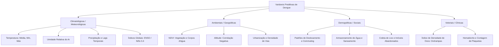

# Síntese Científica e Análise de Dados: Arbovirose da Dengue no DF

Este documento apresenta uma análise detalhada das bases de dados disponíveis (`info-saude` e `dados-gov`) e uma síntese rigorosa dos artigos científicos contidos na pasta `C:\arbodf\DocML\artigos`. O objetivo é fornecer insights práticos e subsidiar tecnicamente o seu projeto de modelagem preditiva de dengue no Distrito Federal (DF).

---

## 1. Síntese da Literatura Científica (Artigos na pasta `artigos`)

Os artigos fornecem abordagens complementares que cobrem desde diagnósticos clínicos baseados em aprendizado de máquina até previsões epidemiológicas baseadas em variáveis climáticas sob a ótica de *One Health*.

> [!NOTE]
> O artigo **"Artificial Intelligence In Medicine.pdf"** foca inteiramente no monitoramento e previsão em tempo real de surtos de **patógenos respiratórios** (como COVID-19) no Canadá e países do sul da África usando CNN, GRU e GNN. Ele não cita dengue em seu texto, mas serve como excelente referência para modelagem de séries temporais biológicas com redes neurais recorrentes.

### 1.1 Algoritmos de Melhor Desempenho

A literatura divide a aplicação de Machine Learning/Deep Learning em duas frentes distintas:

#### A. Classificação e Diagnóstico Clínico (Pacientes Suspeitos)
*Artigo de Referência: Andrade Girón et al. (Informatics 2025 - Revisão Sistemática)*
*   **Support Vector Machines (SVM):** Identificado como o algoritmo mais eficiente e robusto para classificar se um paciente tem dengue ou não com base em sintomas clínicos e dados laboratoriais (presente em 25% dos estudos revisados). A variante **PCA-SVM (poly-5)** destacou-se com **99,52% de acurácia**, 99,75% de sensibilidade e 99,09% de especificidade ao reduzir a dimensionalidade dos dados clínicos antes da classificação.
*   **Random Forest (RF):** O segundo algoritmo mais utilizado (15,62% dos artigos), apresentando acurácia consistente entre **85% e 90%** em dados clínicos.

#### B. Previsão Epidemiológica e Séries Temporais (Contagem de Casos)
*Artigos de Referência: Marcelo da Costa (Tese Sobral-CE, 2025) & Cabrera et al. (Revisão América Latina, 2022)*
*   **Random Forest (RF) com Engenharia de Atributos:** Na tese de Sobral-CE, o Random Forest alcançou um desempenho notável de **$R^2 = 0,80$** (RMSE = 49,32, MAE = 27,38). O ponto crucial é que o Random Forest tradicional sem engenharia de variáveis teve desempenho pífio ($R^2 = -0,27$). O sucesso ocorreu exclusivamente após a criação de:
    1.  *Médias Móveis* (2, 3 e 6 meses) da precipitação e temperatura média.
    2.  *Lags Temporais* (atrasos cronológicos) das variáveis climáticas.
*   **LSTM (Long Short-Term Memory):** Redes Neurais Recorrentes LSTM apresentaram desempenho superior às regressões tradicionais (como SVR - Support Vector Regression) para capturar as flutuações sazonais abruptas e picos epidêmicos ao longo dos anos.
    *   No estudo de *San Juan, Porto Rico* (Cabrera et al., 2022), a rede LSTM demonstrou capacidade superior de capturar tendências de subida e queda de casos em relação à SVR.
    *   No estudo de *Natal, Brasil* (Cabrera et al., 2022), uma rede LSTM que combinava o histórico de casos com o **Índice de Densidade de Ovos (ovitrampas)** obteve coeficientes de correlação de **0,87 a 0,92**, prevendo surtos com 3 a 6 semanas de antecedência.
*   **Ensemble (Modelos Híbridos):** A combinação ponderada de Random Forest e LSTM é útil, mas o seu resultado é severamente arrastado para baixo caso um dos modelos tenha métricas muito ruins (como ocorreu na tese de Sobral, onde o LSTM teve $R^2$ de -0,21 e puxou o Ensemble para $R^2 = 0,13$).

---

### 1.2 Variáveis Mais Importantes nas Previsões

As variáveis preditivas de maior peso são divididas em quatro categorias principais pela literatura:

#### A. Climatológicas e Meteorológicas (As mais críticas)
1.  **Temperatura (Média, Máxima e Mínima):**
    *   *Mecanismo biológico:* Temperaturas elevadas aceleram o desenvolvimento das larvas, produzem mosquitos menores (que digerem sangue mais rápido e necessitam picar com mais frequência) e **reduzem drasticamente o período de incubação extrínseca** do vírus no mosquito (caindo de 12 dias a 30°C para apenas 7 dias entre 32°C e 35°C).
2.  **Umidade Relativa do Ar:**
    *   *Mecanismo biológico:* Níveis elevados de umidade aumentam significativamente a **longevidade do mosquito**, permitindo que ele viva tempo suficiente para incubar o vírus e transmiti-lo a múltiplos hospedeiros.
3.  **Precipitação (Chuva):**
    *   *Mecanismo biológico:* Cria criadouros juvenis em áreas urbanas. Contudo, a literatura destaca que chuvas torrenciais podem "lavar" as larvas temporariamente, mas geram criadouros em abundância no longo prazo.
    *   *Paradoxo da Seca:* Baixa pluviosidade também pode elevar casos devido ao aumento do armazenamento doméstico inadequado de água em recipientes artificiais.
4.  **ENSO (El Niño Oscilação Sul):**
    *   Anomalias na temperatura da superfície do mar no oceano Pacífico (região **Niño 3.4**) alteram o clima na América Latina a cada 2 a 7 anos, desencadeando invernos mais quentes e secos que propiciam surtos históricos.

#### B. Ambientais e Geográficas
1.  **Índice de Densidade de Ovos (Ovitrampas):** O preditor biológico direto de maior relevância temporal.
2.  **NDVI (Normalized Difference Vegetation Index):** Obtido via satélite, serve para mapear corpos d'água (NDVI negativo) e adensamento de vegetação que serve de abrigo úmido para mosquitos.
3.  **Altitude:** Correlação negativa. O *Aedes aegypti* tem dificuldades biomecânicas de voo em altitudes elevadas devido ao ar rarefeito, embora as mudanças climáticas estejam empurrando a linha de transmissão para altitudes antes consideradas seguras.

#### C. Demográficas e Socioeconômicas
1.  **Saneamento e Água Encanada:** A falta de abastecimento regular induz o armazenamento artificial de água em baldes/tambores sem tampa.
2.  **Coleta de Lixo e Imóveis Abandonados:** Lixo exposto acumula água da chuva; casas vazias servem de criadouros sem controle sanitário.
3.  **Mobilidade Populacional (*Commuting*):** Os padrões diários de viagem das pessoas (trabalho/estudo) são os principais disseminadores espaciais do vírus nas manchas urbanas.

---

## 2. Análise Prática das Bases de Dados do Projeto

A leitura estruturada das suas bases de dados revela um ecossistema complementar perfeito para estruturar o seu projeto de dengue no DF:

### 2.1 Base Local: `info-saude`
*Exemplo analisado: `dados_dengue-18052026-ano_2018.csv` (~4 mil registros) e `dados_dengue-10042026-ano_2024.csv` (~325 mil registros).*

Esta base é um registro **altamente focado e georreferenciado localmente** no DF:
*   **Foco Regional:** Entre 94,3% (2018) e 97,6% (2024) dos pacientes registrados de fato **residem no DF**.
*   **Dados Espaciais Ricos:** Possui a coluna `i_desc_radf_res` que identifica a **Região Administrativa (RA)** de residência do paciente (Ceilândia, Samambaia, Santa Maria, Taguatinga, etc.).
*   **Estrutura Simples (15 Colunas Semicolon-Separated):**
    *   *Temporal:* `i_data_prim_sintomas` (excelente para agregar séries temporais diárias ou semanais), `i_ano_semana_prim_sintomas_svs`.
    *   *Clínica Básica:* `i_class_final` ("Caso Provável" vs. "Caso Descartado"), `i_desc_classificacao` ("Dengue").
    *   *Demográfica Básica:* `i_sexo`, `i_faixa_etaria`, `i_desc_raca_cor`.
    *   *Gravidade Básica:* `i_desc_hospitalizacao` ("Sim" ou "Não"), `i_desc_evolucao` ("Cura", "Óbito").

> [!TIP]
> A base de **2024** é uma das mais ricas para análise devido ao grande volume epidêmico no DF (325.032 notificações na base), apresentando dados de localização detalhados (ex: Ceilândia registrou sozinha 42.465 casos residenciais nessa base).

---

### 2.2 Base Nacional: `dados-gov` (SINAN Nacional)
*Exemplo analisado: `DENGBR08.csv` (Ano 2008) e `DENGBR17.csv` (Ano 2017).*

Esta base é o **banco de dados oficial completo do SINAN** (Ficha de Notificação de Dengue do Ministério da Saúde). Embora contenha os dados de todo o Brasil, os registros do DF podem ser filtrados usando o código do IBGE **'53'** nas colunas `SG_UF_NOT` (notificação) e `SG_UF` (residência):
*   **DF em 2008 (`DENGBR08`):** 3.556 casos notificados e 3.277 residentes no DF (dentro de 919.324 registros nacionais).
*   **DF em 2017 (`DENGBR17`):** 6.489 casos notificados e 6.069 residentes no DF (dentro de 518.483 registros nacionais).

#### O Diferencial Técnico: A Riqueza Clínica (107 Colunas)
Ao contrário do `info-saude`, que é resumido, a base do `dados-gov` possui todas as variáveis clínicas e laboratoriais da ficha do SINAN:
*   **Sintomas Clínicos Detalhados:** `FEBRE`, `CEFALEIA`, `EXANTEMA`, `MIALGIA`, `NAUSEAS`, `ARTRALGIA`, `DIARREIA`.
*   **Sinais de Alarme e Gravidade:** `EPISTAXE` (sangramento nasal), `PETEQUIAS`, `GENGIVO` (gengivorragia), `ASCITE`, `PLEURAL` (derrame pleural), `HIPOTENSAO`, `CHOQUE`.
*   **Exames Laboratoriais (Preditor de Gravidade Máxima):** `PLAQ_MENOR` (contagem de plaquetas) e `HEMA_MAIOR` (hematócrito) são variáveis de altíssima relevância clínica.
*   **Marcadores Imunológicos:** `S1_IGM` (sorologia IgM para fase aguda), `S1_IGG` (infecção prévia) e `RESUL_PCR` (confirmação do sorotipo viral DENV1-4).

---

## 3. Recomendações e Próximos Passos para o seu Projeto no DF

Com base no que foi extraído dos artigos e das bases de dados, sugerimos estruturar seu projeto em duas frentes de modelagem:

### Cenário A: Modelagem Epidemiológica (Previsão de Surtos e Alocação de Recursos)
Se o seu objetivo é prever a **quantidade de casos semanais** por Região Administrativa do DF:
1.  **Dataset Principal:** Utilize o `info-saude` agregado semanalmente por Região Administrativa (`i_desc_radf_res`).
2.  **Variáveis Climáticas (Crucial):** Você precisará cruzar esses dados com dados de temperatura, umidade e precipitação do DF (disponíveis publicamente no INMET - Estação Brasília).
3.  **Engenharia de Atributos (Segredo do Desempenho):**
    *   Não use os dados climáticos do próprio mês. Crie **Lags Temporais** de 2 a 8 semanas (o mosquito leva tempo para nascer e o vírus para incubar).
    *   Crie **Médias Móveis** de 2 e 3 meses para suavizar as chuvas e destacar tendências gerais.
4.  **Algoritmo Recomendado:** Comece com **Random Forest** (que se provou o mais estável na literatura brasileira para séries temporais climáticas curtas) com 200 árvores de decisão e, caso tenha uma série temporal longa e contínua de anos, treine uma rede recorrente **LSTM**.

### Cenário B: Classificação e Triagem Clínica (Predição de Gravidade no Atendimento)
Se o seu objetivo é criar uma inteligência para apoiar **hospitais no DF a classificar o risco** de um paciente suspeito evoluir para dengue grave:
1.  **Dataset Principal:** Utilize o `dados-gov` filtrado para o Distrito Federal (`SG_UF == '53'`).
2.  **Atributos de Entrada:** Use a idade (`NU_IDADE`), sexo (`CS_SEXO`), raça (`CS_RACA`), sintomas básicos (`FEBRE`, `CEFALEIA`, `MIALGIA`) e, principalmente, exames como plaquetas (`PLAQ_MENOR`) e hematócrito (`HEMA_MAIOR`).
3.  **Algoritmo Recomendado:** **SVM (Support Vector Machines)** com kernel RBF ou um **XGBoost Classifier** para lidar com dados tabulares desbalanceados de sintomas.
