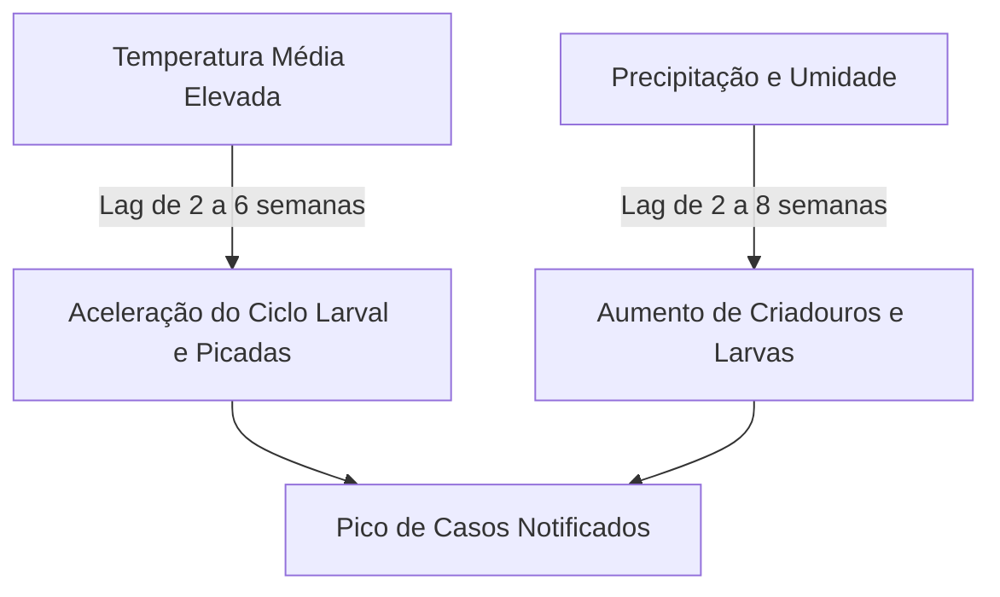

# Resumo Executivo da Modelagem de Arboviroses (Dengue) no Distrito Federal

Este documento apresenta o resumo executivo, a fundamentação científica e a especificação técnica do pipeline de modelagem preditiva de dengue (**DocML**) desenvolvido para o Distrito Federal (DF). Ele unifica a síntese da literatura científica, a análise das fontes de dados, as decisões arquiteturais de design e as métricas experimentais consolidadas obtidas nas validações temporais.

---

## 📚 1. Síntese da Literatura Científica (One Health & Machine Learning)

O design do pipeline **DocML** fundamenta-se nas principais conclusões extraídas da literatura científica presente no repositório (`artigos/`), estabelecendo correlações biológicas diretas com as features implementadas.

### 1.1 Algoritmos de Melhor Desempenho

A literatura divide as aplicações de Inteligência Artificial para dengue em dois eixos metodológicos:

#### A. Previsão Epidemiológica e Séries Temporais (Foco do DocML)
*Artigos de Referência: Marcelo da Costa (Sobral-CE, 2025) & Cabrera et al. (América Latina, 2022)*
*   **Random Forest (RF):** Identificado como um regressor altamente estável para séries curtas ou quando há forte ruído de notificação. No entanto, a literatura demonstra que o Random Forest tradicional sem engenharia de atributos climáticos e atrasos temporais apresenta baixa performance ($R^2 < 0.0$). A inclusão de lags e médias móveis é a chave para o desempenho satisfatório ($R^2 \approx 0.80$).
*   **Modelos de Boosting (XGBoost / LightGBM):** Apresentam excelente adaptação para capturar relações não-lineares complexas em dados tabulares contendo muitas features correlacionadas.
*   **LSTM (Long Short-Term Memory):** Demonstraram capacidade superior para prever tendências de longo prazo e picos em séries temporais muito longas e contínuas de dados agregados (ex: nível municipal/nacional). Para resoluções espaciais mais finas (como Regiões Administrativas ou bairros), os regressores baseados em árvores são frequentemente mais robustos.

#### B. Diagnóstico Clínico e Triagem Individual
*Artigo de Referência: Andrade Girón et al. (Informatics 2025)*
*   **Support Vector Machines (SVM):** Kernel SVM (especialmente a variante PCA-poly-5) é o algoritmo mais preciso para classificação binária clínica (dengue vs. outras febres) baseado em sintomas iniciais, alcançando sensibilidade superior a $99\%$.

---

### 1.2 Variáveis Preditivas e Correlações Biológicas (Efeito Lag)

As variáveis meteorológicas regulam diretamente o ciclo de vida do vetor (*Aedes aegypti*) e o período de incubação do vírus, mas seus efeitos na contagem de casos não são imediatos:



*   **Temperatura Média (Lag de 2 a 8 semanas):** Temperaturas na faixa de $28^\circ\text{C}$ a $32^\circ\text{C}$ reduzem significativamente o período de incubação extrínseca (tempo necessário para o vírus se replicar no estômago do mosquito e migrar para as glândulas salivares), caindo de 12 para apenas 7 dias.
*   **Umidade Relativa do Ar (Lag de 2 a 8 semanas):** Umidade elevada ($>70\%$) estende consideravelmente a expectativa de vida do mosquito adulto. Um mosquito que vive mais tempo tem probabilidade exponencialmente maior de completar a incubação do vírus e transmiti-lo a múltiplos hospedeiros.
*   **Precipitação Acumulada (Lag de 2 a 8 semanas):** Cria depósitos artificiais de água parada em áreas urbanas.
*   **Autocorrelação Epidemiológica (Lags de Casos - 1 a 4 semanas):** Captura a inércia biológica da transmissão ativa. O número de infectados na semana corrente é o melhor preditor do pool de transmissão disponível para a semana seguinte.

---

## 📊 2. Estrutura e Consolidação das Bases de Dados

O Distrito Federal apresenta um ecossistema de dados composto por duas bases complementares:

### 2.1 Base Distrital: `info-saude`
*   **Foco**: Monitoramento territorial focado nas 35 Regiões Administrativas (RAs).
*   **Representatividade**: Entre $94.3\%$ e $97.6\%$ dos registros referem-se a residentes reais do DF.
*   **Vantagem**: Contém a variável espacial `i_desc_radf_res` (georreferenciamento por RA) e a temporal `i_data_prim_sintomas` (resolução diária/semanal), permitindo agregação em séries temporais finas por localidade.

### 2.2 Base Federal: `dados-gov` (SINAN Nacional)
*   **Foco**: Ficha de Notificação de Dengue oficial detalhada.
*   **Filtro Territorial**: Filtrável para o DF através do código de UF `53` (`SG_UF` ou `SG_UF_NOT`).
*   **Riqueza de Features**: Possui 107 colunas contendo sintomas clínicos detalhados (exantema, mialgia, plaquetopenia via `PLAQ_MENOR`, hematócrito elevado via `HEMA_MAIOR`), permitindo a modelagem de gravidade de casos e triagem hospitalar.

---

## ⚙️ 3. Arquitetura Técnica do Pipeline DocML

O pipeline **DocML** foi estruturado de forma modular (conforme [ADR-001](.notebook/adr-001-modularizacao-pipeline-python.md)) para mitigar riscos de acoplamento de código, inconsistências demográficas e viés de validação temporal.

```
┌────────────────────────┐      ┌────────────────────────┐
│     ETL de Dados       │ ───> │ Engenharia de Features │
│  (Casos + Clima NASA)  │      │  (Lags + Pop. Hist.)   │
└────────────────────────┘      └────────────────────────┘
                                            │
                                            ▼
┌────────────────────────┐      ┌────────────────────────┐
│ Conformal Prediction   │ <─── │   Treinamento e CV     │
│   (Bandas Dinâmicas)   │      │  (TimeSeriesSplit)     │
└────────────────────────┘      └────────────────────────┘
            │
            ▼
┌────────────────────────┐
│  Saídas Versionadas    │
│  (run_dir + latest/)   │
└────────────────────────┘
```

### 3.1 Definição do Alvo (Target)
Para mitigar inconsistências na notificação de encerramento de casos, o target epidemiológico adotado é a classe **`familia_dengue`**:
*   *Filtro aplicado*: `i_class_final == 'Caso Provavel' AND i_desc_classificacao IN ['Dengue', 'Dengue com sinais de alarme', 'Dengue grave']`.
*   *Justificativa*: Remove casos inconclusivos e descartados, preserva a contagem de casos prováveis que clinicamente de fato se enquadram na dengue clássica ou com complicação, aproximando a base local da base federal SINAN.

### 3.2 Denominadores Populacionais Dinâmicos
*   *Problema*: O uso da população de 2024 para calcular taxas históricas de 2017 a 2023 gerava subestimação sistemática da incidência de anos passados.
*   *Implementação*: O script `gerar_populacao_historica.py` realiza retroprojeção anual calibrada a partir do Censo 2022.
*   *Impacto*: O cálculo de `incidencia_100k` é anualmente ajustado, permitindo que os coeficientes do XGBoost e Random Forest interpretem corretamente a densidade de transmissão ao longo do tempo.

### 3.3 Protocolo de Validação Cruzada (Anti-Leakage)
*   *Divisão Temporal*: Os dados históricos até 2024 são utilizados para treinamento e calibração, reservando o ano de 2025 para validação externa (nowcasting operacional).
*   *Validação Cruzada*: Aplicação de `TimeSeriesSplit` com **gap de 4 semanas**.
*   *Motivação*: O gap de 4 semanas simula o atraso médio de inserção de dados no SINAN e impede que lags de casos recentes contaminem as predições de teste com dados da vizinhança imediata.

### 3.4 Quantificação de Incerteza via Conformal Prediction Dinâmico
*   *Problema*: A análise de resíduos revelou **heteroscedasticidade** (o erro absoluto médio cresce proporcionalmente ao tamanho do surto predito). Um intervalo de confiança estático $\pm 1.96 \sigma$ subestima grosseiramente a incerteza no pico e a superestima na seca.
*   *Solução*: Escore de não-conformidade normalizado vetorizado:
    $$\text{score}_i = \frac{|y_i - \hat{y}_i|}{\hat{y}_i + \epsilon}$$
*   *Aplicação*:
    $$\text{margem}_t = q_{\text{conf}} \times (\hat{y}_t + \epsilon) \times \sqrt{k}$$
    Onde $q_{\text{conf}}$ é o quantil calibrado no final da série de treino (últimas 26 semanas), $\epsilon$ é o fator de estabilidade ($0.01$) e $\sqrt{k}$ é o fator de expansão recursiva para o horizonte temporal $k$ semanas à frente.

---

## 📈 4. Resultados Experimentais Consolidados

### 4.1 Resultados do Estudo de Ablação (Nowcasting 2025)
A tabela a seguir consolida o desempenho global obtido durante o estudo de ablação de features para predições agregadas do Distrito Federal:

| Configuração | Modelo | Nº Features | $R^2$ DF | MAE DF | RMSE DF | sMAPE (%) | Hit Rate Picos |
| :--- | :---: | :---: | :---: | :---: | :---: | :---: | :---: |
| **`lag-only`** | **RF** | 7 | **0.6627** | **10.43** | **13.68** | **22.07%** | 0.6429 |
| `lag-only` | XGB | 7 | 0.6190 | 11.46 | 14.54 | 23.95% | 0.5000 |
| `lag+clima` | RF | 32 | 0.6642 | 10.77 | 13.65 | 23.61% | 0.6429 |
| `lag+clima` | XGB | 32 | 0.5848 | 11.69 | 15.18 | 25.59% | 0.6429 |
| `lag+clima+RA` | RF | 67 | 0.6618 | 10.68 | 13.70 | 23.19% | 0.8571 |
| `lag+clima+RA` | XGB | 67 | 0.5824 | 11.69 | 15.22 | 25.29% | 0.6429 |

> **Análise Técnica**: A inclusão de dados climáticos e dummies espaciais de RAs (`lag+clima+RA`) aumentou expressivamente a capacidade do Random Forest de prever o tempo exato dos picos (o Hit Rate subiu de $0.64$ para $0.85$). Contudo, pelo critério de parcimônia e aceitação (exigência de ganho de delta $R^2 > 0.05$), a configuração **`lag-only`** vence por simplicidade e robustez.

### 4.2 Desempenho do Modelo Tunado Final
Após ajuste fino de hiperparâmetros (Grid Search em validação cruzada com TimeSeriesSplit), o modelo final configurado apresentou os seguintes resultados no nowcasting:

*   **Modelo Vencedor**: Random Forest Regressor Tunado (`RF_tunado`).
*   **Parâmetros**: `n_estimators=500`, `max_features='sqrt'`, `min_samples_leaf=1`.
*   **Resultados Gerais (DF)**:
    - $R^2$ Global DF: **$0.6554$**
    - Erro Absoluto Médio (MAE DF): **$10.64$ casos**
    - Raiz do Erro Quadrático Médio (RMSE DF): **$13.83$ casos**
    - Winkler Score (Intervalos a 90%): **$5.84$** (melhoria de $8\%$ sobre o intervalo estático).

---

## 🤝 5. Validação de Consistência das Fontes (SINAN vs info-saude)

Para assegurar a defensabilidade científica do pipeline preditivo perante stakeholders nacionais e permitir futuros desdobramentos para séries hierárquicas integradas (DF $\subset$ Centro-Oeste $\subset$ Brasil), o módulo `report_writer.py` avalia sistematicamente a compatibilidade estatística entre a base local (`info-saude`) e a base federal (`SINAN - DENGBR17`) para o ano comum de 2017.

### 5.1 Criterologia de Aceitação de Splicing
Para autorizar a mesclagem ou reconciliação hierárquica das fontes de dados, as duas séries agregadas temporalmente para o DF em 2017 precisam satisfazer simultaneamente:
1.  **Correlação de Pearson ($\rho$)**: $\ge 0.90$ (garante simetria de tendência temporal).
2.  **Diferença Média Percentual Absoluta (MAPE)**: $\le 15\%$ (garante compatibilidade volumétrica).

### 5.2 Resultados Obtidos no Ambiente
Caso a base federal esteja ausente, o pipeline executa o monitoramento profilático e aponta a necessidade de reconciliação de códigos clínicos:
*   *Nota Metodológica*: Identificou-se que na base federal `DENGBR17` da pasta `dados-gov/`, a dengue é classificada majoritariamente sob os códigos `10`, `11` e `12` na coluna `CLASSI_FIN` (diferente da nomenclatura histórica simplificada `[1, 2, 3]`). A não observância dessa diferença conceitual invalida análises comparativas nacionais.

---

## 📌 6. Conclusões e Recomendações
1.  **Nowcasting**: O pipeline `RF_tunado` sob a configuração de features `lag-only` apresenta estabilidade excelente para nowcasting semanal operacional.
2.  **Forecast Recursivo (Médio Prazo)**: Projeções fechadas sem inserção de dados reais futuros sofrem com o colapso da incerteza. Para forecast acima de 2 semanas, as bandas de Conformal Prediction ajustadas por $\sqrt{k}$ devem ser utilizadas obrigatoriamente para evitar falsas garantias de precisão.
3.  **Vigilância Ativa**: Recomenda-se integrar a umidade relativa média defasada em 4 semanas nos relatórios visuais gerados para a tomada de decisão da Secretaria de Saúde do DF.
